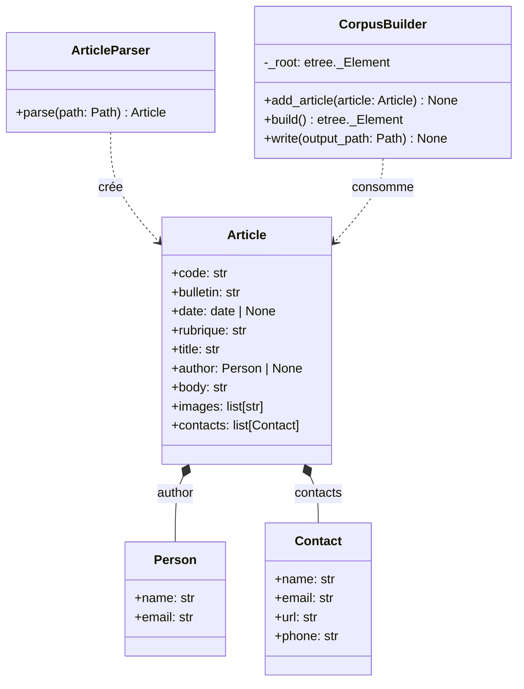
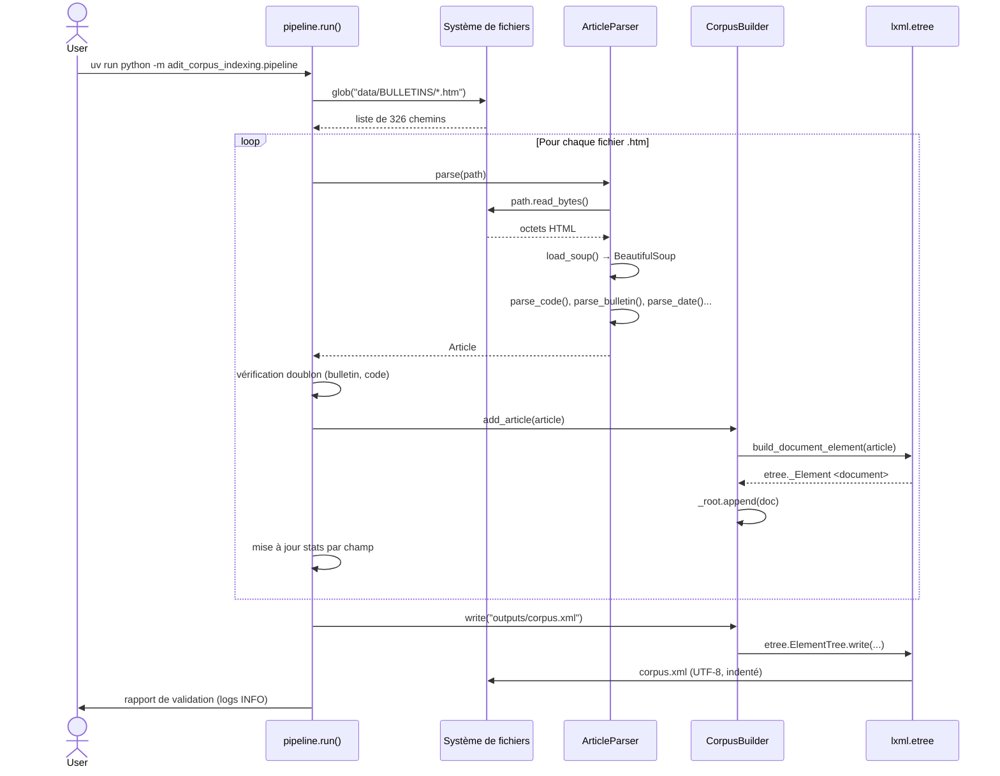
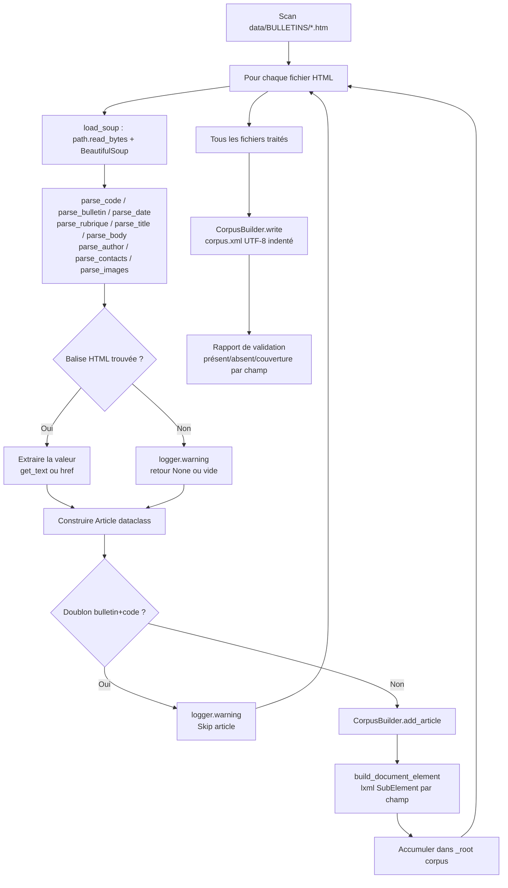
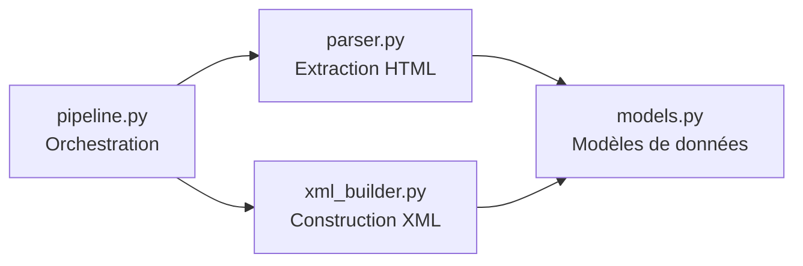

# Compte-rendu TD1 — Préparation du Corpus

**UV :** LO17 — Indexation et Recherche d'Information
**UTC — Printemps 2026**
**Date :** 09/03/2026
**Auteurs :** Pierre FROMONT BOISSEL — Maxime DOUDY (GI04)

---

## Sommaire

1. [Objectif du TD](#1-objectif-du-td)
2. [Architecture et conception](#2-architecture-et-conception)
   - 2.1 [Diagramme de classes](#21-diagramme-de-classes)
   - 2.2 [Flux d'exécution principal](#22-flux-dexécution-principal)
   - 2.3 [Logique d'extraction](#23-logique-dextraction)
   - 2.4 [Dépendances entre modules](#24-dépendances-entre-modules)
3. [Réponse aux consignes](#3-réponse-aux-consignes)
   - 3.1 [Construction du fichier XML unique](#31-construction-du-fichier-xml-unique)
   - 3.2 [Extraction du numéro d'article](#32-extraction-du-numéro-darticle)
   - 3.3 [Extraction du numéro de bulletin](#33-extraction-du-numéro-de-bulletin)
   - 3.4 [Extraction de la date](#34-extraction-de-la-date)
   - 3.5 [Extraction de la rubrique](#35-extraction-de-la-rubrique)
   - 3.6 [Extraction du titre](#36-extraction-du-titre)
   - 3.7 [Extraction de l'auteur](#37-extraction-de-lauteur)
   - 3.8 [Extraction du texte](#38-extraction-du-texte)
   - 3.9 [Extraction des images](#39-extraction-des-images-url-et-légende)
   - 3.10 [Extraction des contacts](#310-extraction-des-contacts)
   - 3.11 [Approche modulaire et incrémentale](#311-approche-modulaire-et-incrémentale)
   - 3.12 [Exhaustivité et contrôle des erreurs](#312-exhaustivité-et-contrôle-des-erreurs)
   - 3.13 [Compatibilité UTF-8](#313-compatibilité-utf-8)
4. [Résultats d'exécution](#4-résultats-dexécution)
   - 4.1 [Sortie du pipeline](#41-sortie-du-pipeline)
   - 4.2 [Couverture du corpus](#42-couverture-du-corpus)
   - 4.3 [Résultats des tests](#43-résultats-des-tests)
   - 4.4 [Couverture de code](#44-couverture-de-code)
5. [Extras](#5-extras)
6. [Difficultés rencontrées](#6-difficultés-rencontrées)
7. [Conclusion](#7-conclusion)

---

## 1. Objectif du TD

Ce TD constitue la première étape du projet LO17, dont le but est de construire un système complet d'indexation et de recherche d'information sur une archive de bulletins de veille technologique de l'ADIT. L'archive étudiée couvre plus de 300 articles extraits de bulletins de veille sur la France entre 2011 et 2014. Chaque article contient des méta-informations structurées (numéro, date, rubrique, auteur) ainsi que des contenus (texte, images, contacts).

L'objectif concret du TD1 est de préparer ce corpus en vue de son indexation future : à partir des fichiers HTML bruts, il faut produire un unique fichier `corpus.xml` structuré, qui rassemble l'ensemble des articles dans un format facilement exploitable. Ce fichier servira de base à toutes les étapes suivantes du projet (construction d'index inversé, moteur de recherche en langage naturel).

La méthode préconisée est incrémentale : traiter un champ à la fois, valider l'extraction sur plusieurs fichiers, puis généraliser à l'ensemble du corpus. La robustesse du traitement est une exigence explicite — le corpus étant bruité, toute absence de champ doit être tolérée et journalisée sans faire planter le programme.

---

## 2. Architecture et conception

### 2.1 Diagramme de classes



**`Article`** est un dataclass central qui modélise un article du corpus ADIT avec tous ses champs. Le choix du dataclass (plutôt qu'un `dict`) permet d'avoir des types annotés, une autocomplétion IDE, et de détecter dès la construction si un champ est absent. Les champs optionnels (`date`, `author`) sont typés `| None` plutôt que `str | None` pour distinguer l'absence totale d'une valeur vide.

**`Person`** et **`Contact`** sont deux dataclasses auxiliaires pour structurer les informations de l'auteur et des contacts. `Contact` est plus riche que `Person` (il ajoute `url` et `phone`), ce qui reflète la richesse variable des entrées « Pour en savoir plus » dans le HTML.

**`ArticleParser`** encapsule la logique de parsing d'un fichier HTML en `Article`. Il délègue à un ensemble de fonctions de module (`parse_code`, `parse_date`, etc.), chacune responsable d'un seul champ — ce qui facilite les tests unitaires par champ.

**`CorpusBuilder`** accumule les `Article` parsés et les sérialise en XML via `lxml.etree`. Il maintient un arbre XML en mémoire (`_root`) et expose `write()` pour la sérialisation finale. Le choix de `lxml.etree` (plutôt que la construction par concaténation de chaînes) garantit un XML valide et bien encodé.

### 2.2 Flux d'exécution principal



Le flux commence par une recherche glob de tous les fichiers `.htm` du répertoire `data/BULLETINS/`. Chaque fichier est parsé indépendamment par `ArticleParser.parse()`, qui retourne un objet `Article`. Le pipeline vérifie les doublons sur la clé `(bulletin, code)` avant d'ajouter l'article au `CorpusBuilder`. En fin de traitement, le corpus est sérialisé en XML et un rapport de couverture par champ est affiché.

### 2.3 Logique d'extraction



La stratégie d'extraction est défensive : chaque fonction de parsing recherche la balise HTML par classe CSS spécifique (`style32`, `style17`, `style95`, etc.). Si la balise est absente, la fonction journalise un avertissement et retourne `None` ou une chaîne vide selon le type de champ — elle ne lève jamais d'exception. Les champs nécessitant une navigation dans les tableaux HTML (auteur, contacts) utilisent un helper `_find_sibling_cell()` qui localise la cellule voisine d'une étiquette `style28` donnée.

Pour les contacts, l'extraction est plus riche : une fois la cellule identifiée, chaque paragraphe `p.style44 > span.style85` est analysé par des expressions régulières pour extraire séparément nom, email, URL et téléphone. Le corps de l'article est obtenu en filtrant les paragraphes `p.style96` dont le premier enfant est un `span.style95`, ce qui exclut proprement les rubriques, dates et titres qui partagent la même classe de paragraphe.

### 2.4 Dépendances entre modules



L'architecture suit une séparation claire des responsabilités : `models.py` définit les structures de données sans aucune dépendance externe, `parser.py` et `xml_builder.py` dépendent uniquement de `models.py`, et `pipeline.py` orchestre les deux en connaissant uniquement leurs interfaces publiques. Cette structure facilite les tests unitaires (chaque module peut être testé indépendamment) et les évolutions futures (on peut changer le format de sortie sans toucher au parser).

---

## 3. Réponse aux consignes

### 3.1 Construction du fichier XML unique

**Consigne :** Construire un fichier XML unique qui rassemble tous les articles dans la structure définie en annexe, avec les balises `<corpus>`, `<document>`, et tous les sous-éléments requis.

**Statut :** ✅

**Implémentation :** Le module `xml_builder.py` fournit `build_document_element()` pour convertir un `Article` en `<document>` XML, et la classe `CorpusBuilder` pour accumuler et sérialiser l'ensemble. Le pipeline appelle `CorpusBuilder.write("outputs/corpus.xml")` en fin de traitement.

```python
# xml_builder.py — sérialisation finale
def write(self, output_path: Path) -> None:
    tree = etree.ElementTree(self._root)
    output_path.parent.mkdir(parents=True, exist_ok=True)
    tree.write(
        str(output_path),
        encoding="utf-8",
        xml_declaration=True,
        pretty_print=True,
    )
```

**Validation :** `test_corpus_builder_write_produces_valid_xml`, `test_corpus_builder_write_creates_file`, `test_corpus_builder_multiple_articles`. Le fichier produit contient 326 documents, parsé sans erreur par `lxml.etree`.

---

### 3.2 Extraction du numéro d'article

**Consigne :** Extraire le numéro de l'article.

**Statut :** ✅

**Implémentation :** `parse_code()` dans `parser.py` recherche tous les `<span class="style15">` contenant le texte "Code", puis suit la balise `<a>` adjacente pour extraire l'identifiant numérique.

```python
def parse_code(soup: BeautifulSoup) -> str:
    for span in soup.find_all("span", class_="style15"):
        if "Code" in span.get_text():
            a_tag = span.find_next("a")
            if isinstance(a_tag, Tag):
                return a_tag.get_text(strip=True)
    logger.warning("Missing article code")
    return ""
```

**Validation :** `test_parse_code_returns_code` (valeur `"67068"`), `test_parse_code_returns_empty_when_missing`, `test_parse_code_returns_empty_when_no_anchor`. Couverture corpus : 326/326 (100%).

---

### 3.3 Extraction du numéro de bulletin

**Consigne :** Extraire le numéro du bulletin.

**Statut :** ✅

**Implémentation :** `parse_bulletin()` localise le `<span class="style32">` qui contient systématiquement l'identifiant du bulletin (ex. `BE France 258`).

**Validation :** `test_parse_bulletin_returns_bulletin`, `test_parse_bulletin_returns_empty_when_missing`. Couverture corpus : 326/326 (100%).

---

### 3.4 Extraction de la date

**Consigne :** Extraire la date au format `jj/mm/aaaa`.

**Statut :** ✅

**Implémentation :** `parse_date()` remonte au `<p>` parent du `style32` et y recherche le `<span class="style42">`. La date est parsée en objet Python `datetime.date` puis reformatée `strftime("%d/%m/%Y")` lors de la sérialisation XML.

```python
def parse_date(soup: BeautifulSoup) -> date | None:
    style32 = soup.find("span", class_="style32")
    ...
    raw = style42.get_text(strip=True)
    try:
        parts = raw.split("/")
        day, month, year = int(parts[0]), int(parts[1]), int(parts[2])
        return date(year, month, day)
    except (ValueError, IndexError):
        logger.warning("Unparseable date value: %r", raw)
        return None
```

**Validation :** `test_parse_date_returns_date`, `test_parse_date_returns_none_on_malformed_date`, `test_parse_date_single_digit_day`. Couverture corpus : 326/326 (100%).

---

### 3.5 Extraction de la rubrique

**Consigne :** Extraire la rubrique (Focus, Événement, Actualité Innovation, En direct des laboratoires…).

**Statut :** ✅

**Implémentation :** `parse_rubrique()` recherche le premier `<span class="style42">` à l'intérieur d'un `<p class="style96">`. Ce sélecteur est distinct de celui utilisé pour la date car `style96` identifie les paragraphes du corps de l'article.

**Validation :** `test_parse_rubrique_returns_rubrique`, `test_parse_rubrique_handles_accented_section`. Couverture corpus : 326/326 (100%).

---

### 3.6 Extraction du titre

**Consigne :** Extraire le titre de l'article.

**Statut :** ✅

**Implémentation :** `parse_title()` localise l'unique `<span class="style17">` du fichier.

**Validation :** `test_parse_title_returns_title`, `test_parse_title_handles_accented_chars`. Couverture corpus : 326/326 (100%).

---

### 3.7 Extraction de l'auteur

**Consigne :** Extraire l'auteur de l'article.

**Statut :** ✅

**Implémentation :** `parse_author()` utilise `_find_sibling_cell()` pour localiser la cellule de tableau voisine de l'étiquette `style28` "Rédacteur", puis extrait nom et email depuis le `<span class="style95">` qu'elle contient. Le préfixe "ADIT - " est supprimé si présent.

**Validation :** `test_parse_author_returns_person`, `test_parse_author_returns_none_when_missing`. Couverture corpus : 326/326 (100%).

---

### 3.8 Extraction du texte

**Consigne :** Extraire le texte de l'article.

**Statut :** ✅

**Implémentation :** `parse_body()` filtre les paragraphes `<p class="style96">` dont le premier enfant `<span>` porte la classe `style95`. Ce filtrage permet de distinguer le corps textuel des rubriques et dates qui partagent la même classe de paragraphe. Les paragraphes sont joints par `\n\n`.

**Validation :** `test_parse_body_returns_text`, `test_parse_body_joins_paragraphs_with_double_newline`, `test_parse_body_ignores_non_style95_first_span`. Couverture corpus : 326/326 (100%).

---

### 3.9 Extraction des images (URL et légende)

**Consigne :** Extraire la ou les images avec leur(s) URL(s) et leur(s) légende(s) respective(s).

**Statut :** ⚠️ Partiel

**Implémentation :** `parse_images()` extrait les URLs des `` présents dans la sidebar gauche `<td class="FWExtra">`, en excluant les espaceurs (`_clear.gif`) et les icônes de navigation (`Resources/`). Les URLs sont sérialisées dans `<urlImage>`. La balise `<legendeImage>` est bien présente dans le XML, mais son contenu est systématiquement vide : les légendes ne sont pas disponibles dans la sidebar HTML du corpus ADIT.

```python
# xml_builder.py — légende toujours vide
legende_el = etree.SubElement(image_el, "legendeImage")
_set_text(legende_el, "")
```

Le corpus contient 326 articles avec images (100%), représentant 1630 entrées `<image>` au total (environ 5 images par article en moyenne).

**Validation :** `test_parse_images_returns_urls`, `test_parse_images_excludes_clear_gif`, `test_parse_images_excludes_resources`.

---

### 3.10 Extraction des contacts

**Consigne :** Extraire les informations de contact.

**Statut :** ✅

**Implémentation :** `parse_contacts()` localise la cellule voisine de "Pour en savoir plus" et parse chaque `<p class="style44"> > <span class="style85">` pour en extraire nom, email (via `href="mailto:"` ou regex), URL et téléphone. Les contacts sans nom, email ni URL sont filtrés.

**Validation :** `test_parse_contacts_returns_contacts`, `test_parse_contacts_extracts_email`, `test_parse_contacts_filters_empty_contacts`. Couverture corpus : 325/326 (99%).

---

### 3.11 Approche modulaire et incrémentale

**Consigne :** Procéder par étapes successives, une fonction par partie de structure, tester et valider avant de généraliser.

**Statut :** ✅

**Implémentation :** Le module `parser.py` expose une fonction publique par champ (`parse_code`, `parse_bulletin`, `parse_date`, `parse_rubrique`, `parse_title`, `parse_body`, `parse_author`, `parse_contacts`, `parse_images`). Chacune est testée indépendamment avec des fixtures HTML dédiées avant d'être intégrée dans `ArticleParser.parse()`.

---

### 3.12 Exhaustivité et contrôle des erreurs

**Consigne :** S'assurer que tous les fichiers ont été traités, que le traitement est correct et valide, contrôler les erreurs et absences de rubriques.

**Statut :** ✅

**Implémentation :** Le pipeline produit en fin d'exécution un rapport tabulaire par champ avec le nombre d'articles présents, absents et le taux de couverture. Les exceptions de parsing sont interceptées par un `try/except` global qui journalise l'erreur et continue. Les doublons sont détectés sur la clé `(bulletin, code)` et journalisés.

```python
# pipeline.py — rapport de validation
for field in _FIELDS:
    present = stats[field]
    missing = total - present
    pct = (present / total * 100) if total else 0.0
    logger.info("%-12s %8d %8d %9.1f%%", field, present, missing, pct)
```

---

### 3.13 Compatibilité UTF-8

**Consigne :** S'assurer que tous les traitements et tous les fichiers produits restent compatibles avec le format UTF-8.

**Statut :** ✅

**Implémentation :** La lecture HTML utilise `path.read_bytes()` (BeautifulSoup gère la détection de charset). La sérialisation XML utilise `encoding="utf-8"` et `xml_declaration=True` dans `lxml.etree`. L'encodage est vérifié par le test `test_corpus_builder_write_utf8_encoding` qui valide la présence d'accents et de caractères spéciaux dans le fichier produit.

---

## 4. Résultats d'exécution

### 4.1 Sortie du pipeline

```
INFO __main__: Found 326 bulletin files
INFO adit_corpus_indexing.xml_builder: Corpus written to outputs/corpus.xml (326 documents)
INFO __main__: ==================================================
INFO __main__: Corpus report — 326 articles written (0 duplicates skipped)
INFO __main__: ==================================================
INFO __main__: Field         Present  Missing   Coverage
INFO __main__: -----------------------------------------
INFO __main__: code              326        0     100.0%
INFO __main__: bulletin          326        0     100.0%
INFO __main__: date              326        0     100.0%
INFO __main__: rubrique          326        0     100.0%
INFO __main__: title             326        0     100.0%
INFO __main__: author            326        0     100.0%
INFO __main__: body              326        0     100.0%
INFO __main__: ==================================================
```

### 4.2 Couverture du corpus

| Champ     | Présent | Absent | Couverture |
|-----------|---------|--------|------------|
| article   | 326     | 0      | 100%       |
| bulletin  | 326     | 0      | 100%       |
| date      | 326     | 0      | 100%       |
| rubrique  | 326     | 0      | 100%       |
| titre     | 326     | 0      | 100%       |
| auteur    | 326     | 0      | 100%       |
| texte     | 326     | 0      | 100%       |
| contact   | 325     | 1      | 99%        |
| images    | 326     | 0      | 100%       |

Le corpus contient 1630 entrées `<image>` au total (environ 5 par article en moyenne). Les `<legendeImage>` sont structurellement présentes mais vides, les légendes n'étant pas disponibles dans le HTML source.

### 4.3 Résultats des tests

```
75 passed in 0.17s
```

### 4.4 Couverture de code

```
Name                                      Stmts   Miss  Cover   Missing
-----------------------------------------------------------------------
src/adit_corpus_indexing/__init__.py          0      0   100%
src/adit_corpus_indexing/models.py           23      0   100%
src/adit_corpus_indexing/parser.py          155      5    97%   58-59, 137, 217, 220
src/adit_corpus_indexing/xml_builder.py      47      0   100%
-----------------------------------------------------------------------
TOTAL                                       225      5    98%
Required test coverage of 80.0% reached. Total coverage: 97.78%
```

Les 5 lignes non couvertes dans `parser.py` correspondent à des chemins d'erreur peu fréquents : l'avertissement « style32 has no parent `<p>` » (lignes 58-59), la construction d'URL à partir d'un domaine sans `http://` (ligne 137), et deux gardes défensives dans `parse_contacts` pour des éléments non-`Tag` (lignes 217, 220).

---

## 5. Extras

### Modélisation riche des contacts (`Contact` et `Person`)

Au-delà de la consigne minimale (un champ `<contact>` textuel), les contacts sont modélisés par un dataclass `Contact` avec quatre attributs distincts (`name`, `email`, `url`, `phone`). Ce choix anticipe les besoins des TD suivants : l'indexation séparée des adresses email et des URLs de contact sera beaucoup plus facile à partir de données structurées que depuis une chaîne brute. Le champ `<contact>` du XML regroupe les noms pour la rétrocompatibilité avec le schéma requis.

### Mode échantillon (`SAMPLE_SIZE`)

Le pipeline accepte une variable d'environnement `SAMPLE_SIZE` pour limiter le traitement à N fichiers. Cela accélère le cycle de développement lors des tests manuels : `SAMPLE_SIZE=10 uv run python -m adit_corpus_indexing.pipeline`.

### Déduplication des articles

Le pipeline détecte et ignore les doublons sur la clé `(bulletin, code)` en journalisant un avertissement. Aucun doublon n'a été trouvé dans le corpus actuel, mais ce mécanisme assure la robustesse si le répertoire venait à contenir des copies.

---

## 6. Difficultés rencontrées

**Encodage des fichiers HTML.** Les fichiers du corpus déclarent `charset=ISO-8859-1` dans leur en-tête HTML, mais le sujet précise qu'ils sont en UTF-8. L'utilisation de `path.read_bytes()` plutôt que `open(..., encoding=...)` permet de laisser BeautifulSoup détecter l'encodage correct automatiquement via les métadonnées du document.

**Distinction rubrique / corps de l'article.** Les paragraphes de rubrique et les paragraphes de texte partagent la classe `style96`. La distinction repose sur la classe du premier enfant `<span>` : `style42` pour les métadonnées (rubrique, date) et `style95` pour le texte. Ce n'est pas documenté dans les fichiers HTML et a nécessité une exploration manuelle de plusieurs bulletins.

**Navigation par tableaux pour l'auteur et les contacts.** Les champs "Rédacteur" et "Pour en savoir plus" ne sont pas identifiés par des attributs stables, mais par le texte d'une cellule de tableau voisine. Le helper `_find_sibling_cell()` centralise cette logique de navigation pour les deux champs.

---

## 7. Conclusion

Ce TD a permis de produire un fichier `corpus.xml` complet et valide, agrégeant les 326 articles du corpus ADIT avec une couverture de 100% pour tous les champs principaux. L'architecture en modules distincts (`models`, `parser`, `xml_builder`, `pipeline`) avec une classe par responsabilité offre une base solide et testable pour la suite du projet.

Sur le plan méthodologique, l'approche défensive d'extraction — une fonction par champ, retour `None` sur absence, journalisation systématique — s'est avérée indispensable face à la variabilité du corpus. La couverture de tests à 98% garantit la fiabilité de chaque extracteur.

Le seul élément partiellement implémenté est l'extraction des légendes d'images (`<legendeImage>`), absentes du HTML source. Pour la suite, le TD2 pourra s'appuyer directement sur `corpus.xml` pour construire l'index inversé, en exploitant notamment les champs `<texte>`, `<rubrique>`, `<date>` et `<contact>`.
