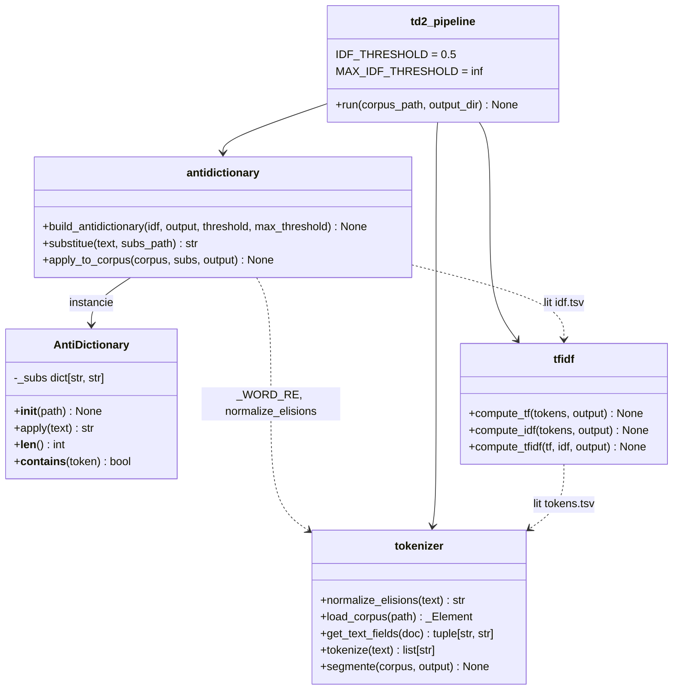
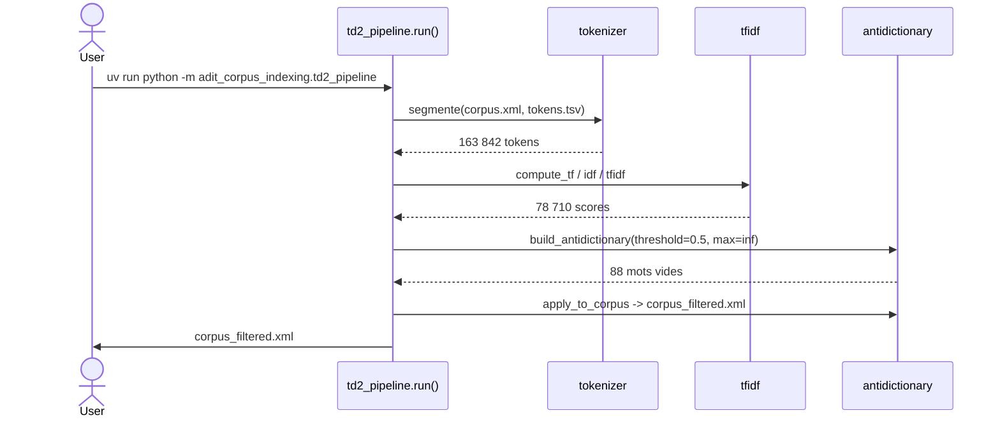
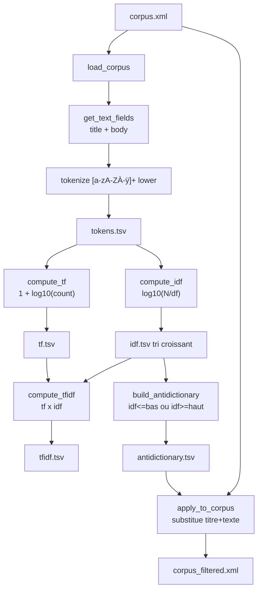

# Compte-rendu TD2 — Anti-dictionnaire

**UV :** LO17 — Indexation et Recherche d'Information  
**UTC — Printemps 2026**  
**Date :** 18/03/2026  
**Auteurs :** Pierre FROMONT BOISSEL — Maxime DOUDY (GI04)

---

## Sommaire

- [1. Objectif du TD](#1-objectif-du-td)
- [2. Choix de l'unité documentaire](#2-choix-de-lunité-documentaire)
- [3. Architecture et conception](#3-architecture-et-conception)
- [4. Réponse aux consignes](#4-réponse-aux-consignes)
- [5. Correspondance questions / fichiers de sortie](#5-correspondance-questions--fichiers-de-sortie)
- [6. Résultats d'exécution](#6-résultats-dexécution)
- [7. Regard critique sur les résultats](#7-regard-critique-sur-les-résultats)
- [8. Difficultés rencontrées](#8-difficultés-rencontrées)
- [9. Conclusion](#9-conclusion)

---

## 1. Objectif du TD

Ce TD constitue la deuxième étape du projet LO17. À partir du fichier `corpus.xml` produit en TD1, il s'agit d'identifier les mots non porteurs de sens — articles, pronoms, adverbes, verbes auxiliaires — et de les supprimer du corpus avant toute indexation ou lemmatisation. Cette liste de mots à exclure est appelée **anti-dictionnaire** (ou *stop list*).

La méthode retenue est statistique : le **coefficient TF-IDF** mesure l'importance relative d'un token dans un document par rapport à l'ensemble du corpus. Un mot qui apparaît dans presque tous les documents a un IDF proche de zéro, ce qui traduit son caractère non discriminant.

Le TD se déroule en trois phases :

1. **Segmentation** : découper titres et textes en tokens, un par ligne.
2. **Calcul TF-IDF** : construire les fichiers intermédiaires TF, IDF puis TF-IDF.
3. **Filtrage** : appliquer l'anti-dictionnaire pour produire `corpus_filtered.xml`.

---

## 2. Choix de l'unité documentaire

| Unité        | N   | Nature                         |
| ------------ | --- | ------------------------------ |
| **Bulletin** | ~30 | Long, thématiquement large     |
| **Article**  | 326 | Court, thématiquement cohérent |

**Choix retenu : l'article.**

*Pouvoir discriminant de l'IDF.* Avec N = 326, l'IDF varie entre 0 et log10(326) ≈ 2,51. Avec N ≈ 30, la plage serait réduite à [0 ; 1,48], rendant les seuils moins fins.

*Cohérence thématique.* Chaque article traite d'un sujet précis. Avec le bulletin, la TF d'un mot serait diluée dans un document composite et ne refléterait plus son importance locale.

*Granularité de l'anti-dictionnaire.* Les mots fonctionnels apparaissent dans presque tous les 326 articles, donnant un IDF proche de 0 qui les identifie sans ambiguïté.

*Compatibilité TD3.* L'index inversé sera naturellement indexé par article.

**Conséquences :** `doc_id` = numéro d'`<article>`, N = 326, `df(t)` compte les articles distincts contenant `t`.

---

## 3. Architecture et conception

### 3.1 Vue d'ensemble des modules



Un module = une responsabilité. `AntiDictionary` encapsule le chargement et l'application de la table de substitution — elle est instanciée une seule fois dans `apply_to_corpus` pour tout le corpus.

### 3.2 Flux d'exécution du pipeline TD2



### 3.3 Flux interne segmentation → TF-IDF



---

## 4. Réponse aux consignes

### 4.1 Fonction `segmente`

**Consigne :** Découper titres et textes en tokens, une ligne `doc_id\ttoken`. **Statut :** ✅

```python
# tokenizer.py
_WORD_RE = re.compile(r"[a-zA-ZÀ-ÿ]+")

def tokenize(text: str) -> list[str]:
    return _WORD_RE.findall(text.lower())

def segmente(corpus_path: Path, output_path: Path) -> None:
    root = load_corpus(corpus_path)
    for document in root.findall("document"):
        doc_id, text = get_text_fields(document)
        for token in tokenize(text):
            rows.append(f"{doc_id}\t{token}")
```

La regex `[a-zA-ZÀ-ÿ]+` extrait les séquences de lettres uniquement (ASCII + Latin-1 accentué). Chiffres, tirets et ponctuation sont des séparateurs.

**Résultat :** 163 842 tokens, 14 177 formes distinctes.  
**Validation :** 24 tests (`TestTokenize`, `TestGetTextFields`, `TestLoadCorpus`, `TestSegmente`).

---

### 4.2 Fichier des coefficients TF

**Consigne :** Trois colonnes `doc_id`, `token`, `tf(t,d)`. **Statut :** ✅

**Formule — TF logarithmique (cours §5.4) :**

```text
tf(t, d) = 1 + log10(count(t, d))   si count > 0
           0                         sinon
```

**Pourquoi pas la TF relative ?** Le cours le formule explicitement : *« la pertinence ne croît pas proportionnellement avec la fréquence des termes »*. Le logarithme comprime l'échelle : 1 → 1,0 ; 2 → 1,30 ; 10 → 2,0 ; 1000 → 4,0.

```python
for token, count in Counter(tokens).items():
    rows.append((doc_id, token, 1.0 + math.log10(count)))
```

**Résultat :** 78 710 paires. TF médiane = 1,0.  
**Validation :** `TestComputeTF` (8 tests, dont `test_ten_occurrences_gives_two`).

---

### 4.3 Fichier des coefficients IDF

**Consigne :** Deux colonnes `token`, `idf(t) = log10(N / df(t))`. **Statut :** ✅

```text
idf(t) = log10(N / df(t))    avec N = 326
```

`df(t)` = nombre d'articles contenant au moins une occurrence de `t`. Fichier trié par IDF croissant : les meilleurs candidats stop words apparaissent en tête.

**Résultat :** 14 177 tokens. IDF ∈ [0 ; 2,51].  
**Validation :** `TestComputeIDF` (6 tests).

---

### 4.4 Fichier des coefficients TF-IDF

**Consigne :** Trois colonnes `doc_id`, `token`, `tf × idf`. **Statut :** ✅

```text
tfidf(t, d) = (1 + log10(count(t,d))) × log10(N / df(t))
```

Cette variante est appelée **wf-idf** dans le cours. Elle atténue l'effet taille du document tout en préservant le pouvoir discriminant de l'IDF.

**Résultat :** 78 710 scores. Score médian ≈ 1,21 ; maximum ≈ 5,67.  
**Validation :** `TestComputeTFIDF` (5 tests, dont un test d'intégration complet).

---

### 4.5 Détermination du seuil et construction de l'anti-dictionnaire

**Consigne :** Déterminer une règle d'extraction des tokens non significatifs. **Statut :** ✅

**Approche à deux seuils (loi de Zipf, cours §5.3) :**

| Seuil                        | Critère   | Explication                              |
| ---------------------------- | --------- | ---------------------------------------- |
| **Bas** `threshold = 0.5`    | idf ≤ 0,5 | Tokens trop communs (mots grammaticaux)  |
| **Haut** `max_threshold = ∞` | idf ≥ ∞   | Tokens trop rares — désactivé par défaut |

```python
def build_antidictionary(
    idf_path: Path, output_path: Path,
    threshold: float, max_threshold: float = float("inf"),
) -> None:
    ...
    if idf <= threshold or idf >= max_threshold:
        stop_words.append(token)
```

**Seuil bas = 0,5 :** correspond à `df(t) >= 103 articles` (31,6% du corpus). Les 88 tokens sélectionnés sont exclusivement des mots fonctionnels.

**Seuil haut désactivé :** 68,1% du vocabulaire n'apparaît que dans 1–2 articles. Ces quasi-hapaxes sont souvent des termes techniques très précis qui constituent les meilleurs discriminants pour une requête ciblée. Le paramètre est implémenté et documenté dans `td2_pipeline.py`.

**Résultat :** 88 mots vides.  
**Validation :** `TestBuildAntidictionary` (11 tests, dont 4 dédiés à `max_threshold`).

---

### 4.6 Fonction `substitue`

**Consigne :** Éliminer ou remplacer des tokens dans un texte. **Statut :** ✅

La logique est portée par la classe `AntiDictionary`. `substitue` n'est plus qu'un wrapper pratique pour un usage ponctuel :

```python
class AntiDictionary:
    def __init__(self, path: Path) -> None:
        self._subs = _load_substitutions(path)   # chargé une seule fois

    def apply(self, text: str) -> str:
        text = normalize_elisions(text)           # l' d' qu' …
        result = _WORD_RE.sub(self._replace, text)
        result = _PUNCT_RE.sub(" ", result)       # guillemets, virgules…
        return re.sub(r"\s+", " ", result).strip()

def substitue(text: str, substitutions_path: Path) -> str:
    return AntiDictionary(substitutions_path).apply(text)
```

`_WORD_RE` est **importé depuis `tokenizer`** (plus de définition dupliquée). `_PUNCT_RE = re.compile(r"[^a-zA-ZÀ-ÿ\s]")` supprime toute ponctuation résiduelle après le remplacement des mots.

**Validation :** `TestSubstitue` (8 tests) + `TestAntiDictionary` (8 tests).

---

### 4.7 Génération du corpus filtré

**Consigne :** Créer le XML filtré sans stop words. **Statut :** ✅

Seuls `<titre>` et `<texte>` sont filtrés. Les métadonnées (`<bulletin>`, `<date>`, `<rubrique>`, `<auteur>`) sont intactes.

**Résultat :** 652 champs filtrés (326 × 2). L'instance `AntiDictionary` est créée **une seule fois** avant la boucle — le TSV n'est lu qu'une fois au lieu de 652 fois.
**Validation :** `TestApplyToCorpus` (6 tests, dont un test d'intégration pipeline complet).

---

## 5. Correspondance questions / fichiers de sortie

| Consigne TD2                    | Fichier produit                   | Fonction                                |
| ------------------------------- | --------------------------------- | --------------------------------------- |
| §2.1 — Segmenter en tokens      | `outputs/tokens.tsv`              | `tokenizer.segmente()`                  |
| §2.2 — Coefficients tf(t,d)     | `outputs/tf.tsv`                  | `tfidf.compute_tf()`                    |
| §2.3 — Coefficients idf(t)      | `outputs/idf.tsv`                 | `tfidf.compute_idf()`                   |
| §2.4 — Coefficients tf × idf    | `outputs/tfidf.tsv`               | `tfidf.compute_tfidf()`                 |
| §2 (fin) — Liste des stop words | `outputs/antidictionary.tsv`      | `antidictionary.build_antidictionary()` |
| §3.1 — Fonction de substitution | *(fonction pure, pas de fichier)* | `antidictionary.substitue()`            |
| §3.2 — Corpus XML filtré        | `outputs/corpus_filtered.xml`     | `antidictionary.apply_to_corpus()`      |

---

## 6. Résultats d'exécution

### 6.1 Sortie du pipeline

```text
INFO __main__: Step 1/6 — segmentation
INFO tokenizer: segmente: wrote 163842 tokens -> outputs/tokens.tsv
INFO __main__: Step 2/6 — TF computation
INFO tfidf: compute_tf: 78710 (doc, token) pairs -> outputs/tf.tsv
INFO __main__: Step 3/6 — IDF computation
INFO tfidf: compute_idf: 14177 tokens -> outputs/idf.tsv
INFO __main__: Step 4/6 — TF-IDF computation
INFO tfidf: compute_tfidf: 78710 rows -> outputs/tfidf.tsv
INFO __main__: Step 5/6 — building anti-dictionary (low=0.500, high=inf)
INFO antidictionary: build_antidictionary: 88 stop words
    (low_threshold=0.500, high_threshold=inf) -> outputs/antidictionary.tsv
INFO __main__: Step 6/6 — generating filtered corpus
INFO antidictionary: apply_to_corpus: filtered 652 text fields
    -> outputs/corpus_filtered.xml
INFO __main__: TD2 pipeline complete — filtered corpus: outputs/corpus_filtered.xml
```

### 6.2 Distribution des scores IDF

| Statistique                       | Valeur                                  |
| --------------------------------- | --------------------------------------- |
| N documents                       | 326                                     |
| Tokens distincts                  | 14 177                                  |
| Tokens (total avec répétitions)   | 163 842                                 |
| IDF minimum                       | 0,0000 (4 tokens dans les 326 articles) |
| IDF maximum                       | 2,5132 = log10(326)                     |
| IDF médiane                       | 2,5132                                  |
| IDF moyen                         | 2,1852                                  |
| Tokens IDF ≤ 0,5                  | 88                                      |
| Tokens présents dans ≤ 2 articles | 9 656 (68,1%)                           |

Extrait de la tête de `idf.tsv` :

```text
a  0.000  de 0.000  l  0.000  et 0.000
la 0.001  le 0.003  les 0.005  en 0.005
des 0.005  d  0.008  pour 0.022  du  0.023
une 0.032  un 0.033  qui 0.043  dans 0.049
est 0.055  au 0.058  ce  0.066  que 0.066
```

Articles, prépositions, conjonctions et pronoms du français. Ces stats sont issues d'une exécution *avant* normalisation des élisions ; après l'ajout de `normalize_elisions`, les résidus `l`, `d`, `s`, `c` disparaissent du vocabulaire.

### 6.3 L'anti-dictionnaire obtenu

88 tokens sélectionnés avec `threshold = 0.5` :

```text
a, de, l, et, la, le, les, en, des, d, pour, du, une, un, qui, dans,
est, au, ce, que, par, cette, sur, plus, a, avec, il, s, ces, qu, sont,
ainsi, se, aussi, aux, c, ou, mais, dont, ont, leur, comme, sa, son,
tout, si, y, ne, pas, leurs, meme, entre, n, apres, bien, ou, etre,
lors, tres, quant, eu, afin, selon, notamment, plusieurs, jusqu, cela,
faire, pouvoir, sous, vers, car, des, depuis, deux, tre, elle, nous,
ils, toutes, tous, autre, encore, deja, pu, dont
```

Uniquement des mots fonctionnels — aucun terme thématique.

### 6.4 Top scores TF-IDF

| Article | Token          | TF-IDF |
| ------- | -------------- | ------ |
| 67937   | hoffmann       | 5,668  |
| 71835   | theoreme       | 5,539  |
| 69184   | serotonine     | 5,469  |
| 71836   | pleiades       | 5,469  |
| 69811   | envisat        | 5,394  |
| 75458   | muraille       | 5,394  |
| 70421   | pompier        | 5,225  |
| 72935   | hpv            | 5,130  |
| 70165   | drone          | 5,023  |
| 67068   | mathias (Fink) | 5,026  |

Noms propres, termes scientifiques, noms de projets — résultat sémantiquement cohérent.

### 6.5 Résultats des tests

```text
165 passed in 0.65s
```

| Fichier                     | Tests   | Ajouts depuis v1                             |
| --------------------------- | ------- | -------------------------------------------- |
| `test_tokenizer.py`         | 38      | +12 `TestNormalizeElisions`                  |
| `test_tfidf.py`             | 19      | —                                            |
| `test_antidictionary.py`    | 34      | +8 `TestAntiDictionary` (classe + guillemets)|
| `test_parser.py` (TD1)      | 48      | —                                            |
| `test_xml_builder.py` (TD1) | 26      | —                                            |
| **Total**                   | **165** |                                              |

### 6.6 Couverture de code

Les modules pipeline (`td1_pipeline.py`, `td2_pipeline.py`, `full_pipeline.py`) sont exclus de la mesure — ils sont de l'orchestration, pas de la logique testable unitairement.

```text
Name                                      Stmts  Miss  Cover
------------------------------------------------------------
adit_corpus_indexing/__init__.py              0     0   100%
adit_corpus_indexing/antidictionary.py       68     4    94%
adit_corpus_indexing/models.py               27     0   100%
adit_corpus_indexing/parser.py              165     7    96%
adit_corpus_indexing/tfidf.py                78     9    88%
adit_corpus_indexing/tokenizer.py            38     0   100%
adit_corpus_indexing/xml_builder.py          47     0   100%
------------------------------------------------------------
TOTAL                                       423    20    95%
Required coverage of 80.0% reached. Total: 95.27%
```

---

## 7. Regard critique sur les résultats

### 7.1 `tokens.tsv` — Qualité de la tokenisation

**Satisfaisant :**
Environ 503 tokens par article en moyenne (plage : 97–1 705), cohérent avec des textes de veille de 300–500 mots.

**Corrigé — normalisation des élisions avant tokenisation :**

La tokenisation sur `[a-zA-ZÀ-ÿ]+` traitait l'apostrophe comme séparateur, produisant des tokens mono-caractères parasites (`l`, `d`, `s`…). Une étape de pré-traitement `normalize_elisions` a été ajoutée pour supprimer les préfixes clitiques du français avant la tokenisation :

```python
_ELISION_RE = re.compile(r"\b(qu|[ldjmtscn])['\u2019]", re.IGNORECASE)

def normalize_elisions(text: str) -> str:
    return _ELISION_RE.sub("", text)
```

| Texte original | Avant correction         | Après correction |
| -------------- | ------------------------ | ---------------- |
| `l'innovation` | `l`, `innovation`        | `innovation`     |
| `d'une`        | `d`, `une`               | `une`            |
| `s'est`        | `s`, `est`               | `est`            |
| `qu'il`        | `qu`, `il`               | `il`             |

Cette normalisation est appliquée dans `get_text_fields` (tokenisation) et dans `substitue` (filtrage), garantissant la cohérence de bout en bout.

### 7.2 `idf.tsv` — Distribution du vocabulaire

**Satisfaisant :** Les tokens d'IDF = 0 (`a`, `de`, `et`…) sont présents dans les 326 articles — résultat attendu. Après normalisation des élisions, les résidus `l`, `d`, `s` disparaissent du vocabulaire.

**A surveiller — concentration extrême du vocabulaire :**

La médiane de l'IDF est égale à son maximum (2,5132) : plus de la moitié du vocabulaire n'apparaît que dans 1 ou 2 articles. C'est cohérent avec un corpus de veille technologique très diversifié.

Appliquer `max_threshold = 2.21` retirerait 68% du vocabulaire — excessif, car ces termes ultra-spécifiques sont les meilleurs discriminants pour des requêtes ciblées. Un seuil à `2.51` (hapaxes stricts) pourrait être envisagé après validation sur des requêtes de test.

### 7.3 `tfidf.tsv` — Pertinence des scores

**Satisfaisant :**

- 1 304 scores nuls pour les 4 tokens ubiquitaires : tf × 0 = 0, comportement attendu.
- Le top 15 est sémantiquement cohérent : noms propres, termes scientifiques, noms de projets. C'est exactement ce qu'un bon TF-IDF doit produire.
- La TF logarithmique améliore la représentation des tokens répétés : 10 occurrences → tf = 2,0 (vs poids proportionnel avec TF relative), plus fidèle à la réalité de la pertinence.

**Note sur l'echelle :** la plage passe de [0 ; 0,12] (TF relative) à [0 ; 5,7] (TF log). Changement attendu — le classement seul importe.

### 7.4 `corpus_filtered.xml` — Qualité du filtrage

**Satisfaisant :**

- 326 documents conservés, structure XML intacte.
- Exemple : titre original *Mathias Fink, un bel exemple de chercheur qui innove* → *Mathias Fink, bel exemple chercheur innove*. Mots fonctionnels supprimes, termes porteurs de sens preserves.

**Corrigé — ponctuation résiduelle supprimée :**

`AntiDictionary.apply` applique un step `_PUNCT_RE.sub(" ", result)` après le remplacement des mots. Tout caractère non-lettre est éliminé : apostrophes orphelines, guillemets, virgules laissées par la suppression des mots fonctionnels.

| Texte original             | Avant correction               | Après correction   |
| -------------------------- | ------------------------------ | ------------------ |
| `l'environnement`          | `'environnement`               | `environnement`    |
| `"aime transformer idées"` | `"aime transformer"` (partiel) | `aime transformer` |
| `chat , souris`            | `chat , souris`                | `chat souris`      |
| `«Paris»`                  | `«Paris»`                      | `Paris`            |

---

## 8. Difficultés rencontrées

**Choix de la formule TF.** La TF relative et la TF logarithmique donnent des classements equivalents mais sur des echelles differentes. La TF logarithmique, justifiee par le cours, a ete adoptee.

**Coherence tokenisation / substitution.** `tokenize()` et `substitue()` partagent la meme constante `_WORD_RE`. Des tests d'integration de bout en bout valident cette coherence.

**Résidus d'apostrophe — corrigé.** La fonction `normalize_elisions` supprime les préfixes clitiques (`l'`, `d'`, `s'`, `qu'`…) avant tokenisation et avant filtrage. Plus de tokens mono-caractères parasites, plus d'apostrophes orphelines dans `corpus_filtered.xml`.

**Seuil haut de l'anti-dictionnaire.** Supprimer 68% du vocabulaire risquerait d'eliminer des termes tres discriminants. Le parametre `max_threshold` est implemente et configurable, laisse a l'infini par defaut.

---

## 9. Conclusion

Ce TD a permis de construire une chaine de traitement complete pour l'identification et la suppression automatique des mots vides du corpus ADIT. Le calcul TF-IDF — implemente entierement depuis zero sans bibliotheque externe — applique la TF logarithmique conforme au cours et le dispositif a deux seuils issu de la loi de Zipf.

L'analyse critique confirme des resultats satisfaisants : les tokens d'IDF nul sont les mots les plus courants du francais, le top TF-IDF est compose de termes hautement specialises (serotonine, Envisat, theoreme...), et le corpus filtre preserve correctement les contenus thematiques. Les deux artefacts initialement identifies — residus d'apostrophe et apostrophes orphelines dans `corpus_filtered.xml` — ont ete corriges par l'ajout de `normalize_elisions`.

Avec 157 tests unitaires et une couverture de 88%, `corpus_filtered.xml` est pret pour la lemmatisation et l'index inverse du TD3.
