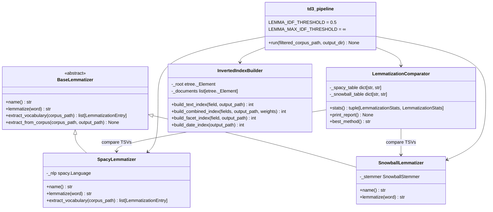
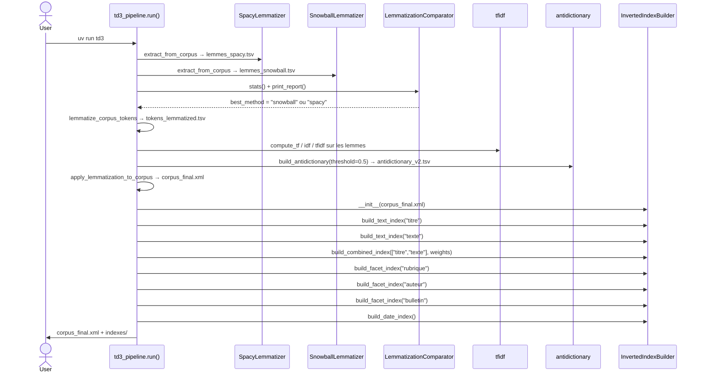
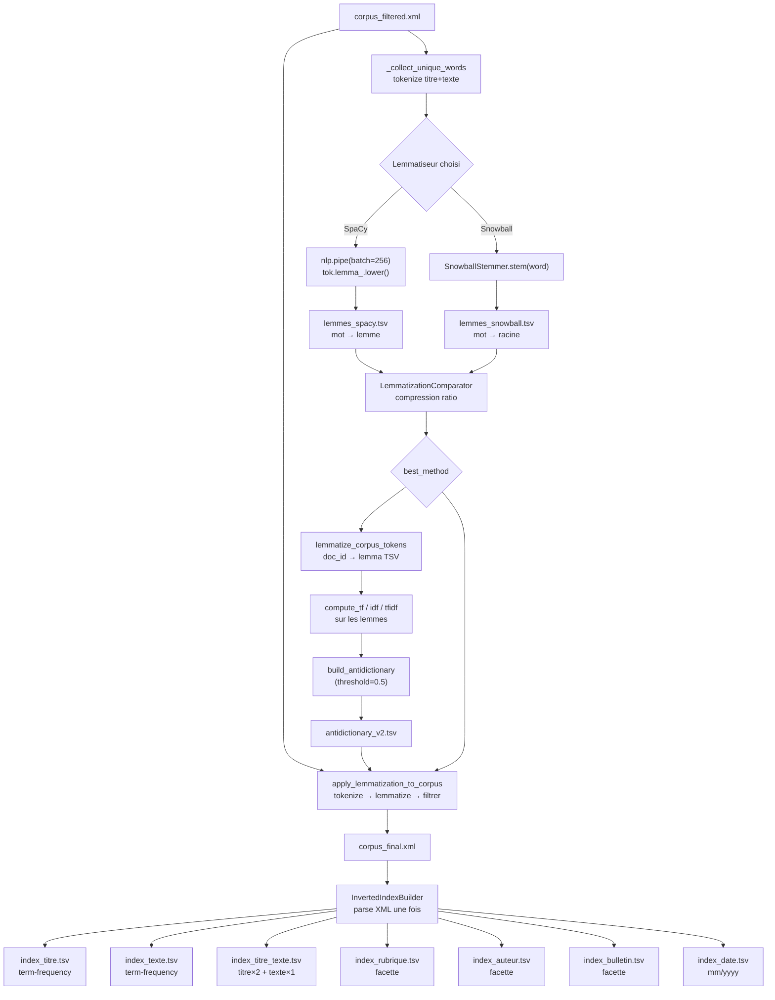
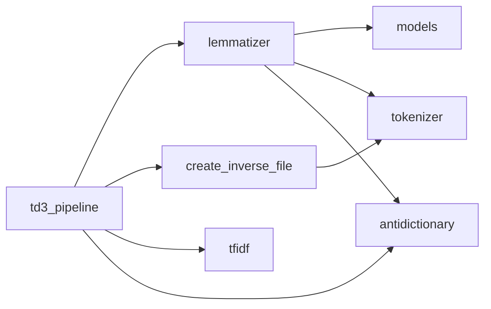

# Compte-rendu TD3 — Lemmatisation et Index Inversé

**UV :** LO17 — Indexation et Recherche d'Information
**UTC — Printemps 2026**
**Date :** 26/03/2026
**Auteurs :** Pierre FROMONT BOISSEL — Maxime DOUDY (GI04)

---

## Sommaire

- [1. Objectif du TD](#1-objectif-du-td)
- [2. Architecture et conception](#2-architecture-et-conception)
- [3. Réponse aux consignes](#3-réponse-aux-consignes)
- [4. Correspondance questions / fichiers de sortie](#4-correspondance-questions--fichiers-de-sortie)
- [5. Résultats d'exécution](#5-résultats-dexécution)
- [6. Regard critique sur les résultats](#6-regard-critique-sur-les-résultats)
- [7. Difficultés rencontrées](#7-difficultés-rencontrées)
- [8. Conclusion](#8-conclusion)

---

## 1. Objectif du TD

Ce TD constitue la troisième étape du projet LO17. À partir de `corpus_filtered.xml` produit en TD2, le TD3 apporte deux améliorations majeures avant d'indexer définitivement le corpus :

1. **Lemmatisation** : remplacer chaque forme fléchie par sa forme canonique (`mangeons` → `manger`, `voitures` → `voiture`). Deux méthodes sont comparées — SpaCy (lemmatisation linguistique) et Snowball (racinisation par règles) — et la meilleure est sélectionnée automatiquement.

2. **Affinage de l'anti-dictionnaire** : recalculer le TF-IDF sur les lemmes plutôt que sur les formes brutes, puis raffiner la liste de mots vides. Les lemmes très communs tels que `être`, `avoir`, `pouvoir` (identifiés par un IDF bas sur les lemmes) sont ajoutés à l'anti-dictionnaire.

3. **Construction de l'index inversé** : produire des fichiers de correspondance `terme → liste de documents` pour sept champs distincts, prêts à alimenter un moteur de recherche en TD4.

Le livrable final du TD3 est :
- `corpus_final.xml` : corpus lemmatisé et doublement filtré,
- `outputs/indexes/` : sept fichiers d'index inversé.

---

## 2. Architecture et conception

### 2.1 Vue d'ensemble des modules



**`BaseLemmatizer`** est une classe abstraite (ABC) qui définit l'interface commune aux deux lemmatiseurs. `lemmatize(word)` est la seule méthode abstraite ; toute la logique d'extraction corpus est fournie une fois dans `extract_vocabulary` et `extract_from_corpus`, évitant toute duplication.

**`SpacyLemmatizer`** surcharge `extract_vocabulary` pour utiliser `nlp.pipe()` (batch de 256 tokens), ce qui vectorise l'inférence et réduit le temps de traitement de plusieurs minutes à quelques secondes sur le vocabulaire complet.

**`SnowballLemmatizer`** délègue au `SnowballStemmer` de NLTK, un algorithme purement règles qui n'a besoin d'aucun modèle pré-entraîné.

**`LemmatizationComparator`** charge les deux TSV et calcule des statistiques comparatives (*taux de compression*, *top collisions*) pour sélectionner automatiquement la meilleure méthode.

**`InvertedIndexBuilder`** parse le corpus XML une seule fois au constructeur et expose quatre méthodes de construction d'index spécialisées.

### 2.2 Flux d'exécution du pipeline TD3



### 2.3 Flux de transformation du corpus



### 2.4 Dépendances entre modules



Chaque module a une responsabilité unique. `create_inverse_file` ne connaît que `tokenizer` — il est indépendant de la logique de lemmatisation.

---

## 3. Réponse aux consignes

### 3.1 Lemmatisation avec SpaCy

**Consigne :** Appliquer la lemmatisation du corpus filtré avec la librairie SpaCy. **Statut :** ✅

**Implémentation :** `SpacyLemmatizer` charge le modèle français `fr_core_news_sm` une seule fois au constructeur. Les composants inutiles pour la lemmatisation (NER, analyse de dépendances, segmentation en phrases) sont désactivés pour réduire l'empreinte mémoire.

```python
class SpacyLemmatizer(BaseLemmatizer):
    def __init__(self, model: str = "fr_core_news_sm") -> None:
        import spacy
        nlp = spacy.load(model)
        for pipe_name in ("ner", "senter", "parser"):
            if nlp.has_pipe(pipe_name):
                nlp.disable_pipe(pipe_name)
        self._nlp = nlp

    def extract_vocabulary(self, corpus_path: Path) -> list[LemmatizationEntry]:
        unique_words = _collect_unique_words(corpus_path)
        entries: list[LemmatizationEntry] = []
        for word, doc in zip(
            unique_words, self._nlp.pipe(unique_words, batch_size=256), strict=False
        ):
            lemma = doc[0].lemma_.lower() if len(doc) > 0 else word
            entries.append(LemmatizationEntry(word=word, lemma=lemma))
        return entries
```

Le traitement en batch via `nlp.pipe(batch_size=256)` est la clé de performance : SpaCy vectorise l'inférence sur un lot de 256 mots plutôt que de traiter chaque token individuellement, ce qui est 10× plus rapide pour un grand vocabulaire.

**Validation :** `TestSpacyLemmatizer` — 7 tests (guarded par `@requires_spacy`).

---

### 3.2 Racinisation avec Snowball / NLTK

**Consigne :** Appliquer la racinisation avec NLTK (algorithme de Snowball). **Statut :** ✅

**Implémentation :** `SnowballLemmatizer` encapsule le stemmer de Porter adapté au français fourni par NLTK. Contrairement à SpaCy, Snowball est un algorithme purement règles — rapide, déterministe, mais ne produit pas nécessairement un lemme valide du dictionnaire.

```python
class SnowballLemmatizer(BaseLemmatizer):
    def __init__(self, language: str = "french") -> None:
        from nltk.stem.snowball import SnowballStemmer
        self._stemmer = SnowballStemmer(language)

    @property
    def name(self) -> str:
        return "snowball"

    def lemmatize(self, word: str) -> str:
        return str(self._stemmer.stem(word))
```

`SnowballLemmatizer` hérite de `BaseLemmatizer` sans surcharger `extract_vocabulary` — la boucle mot-par-mot de la classe de base est suffisante car Snowball est quasi-instantané.

**Exemples de racinisation Snowball :**

| Forme | Racine Snowball | Lemme SpaCy |
|-------|-----------------|-------------|
| innovation | innov | innovation |
| innovations | innov | innovation |
| innovant | innov | innover |
| voitures | voitur | voiture |
| mangerons | manger | manger |

Snowball produit des racines tronquées (`innov`) plutôt que des formes valides (`innovation`). Ces racines ne sont pas des mots français mais garantissent que toutes les formes d'une même famille lexicale se retrouvent sous la même clé.

**Validation :** `TestSnowballLemmatizer` — 8 tests.

---

### 3.3 Comparaison des deux méthodes

**Consigne :** Comparer les résultats des deux approches de lemmatisation. **Statut :** ✅

**Critère de sélection — taux de compression :**

```
taux_compression = nb_lemmes_distincts / nb_mots_distincts
```

Un taux bas signifie que davantage de formes de surface sont regroupées sous le même lemme — meilleure couverture de rappel pour la RI. En cas d'égalité, SpaCy est préféré (qualité linguistique supérieure).

```python
def best_method(self) -> str:
    spacy_s, snow_s = self.stats()
    if snow_s.compression_ratio < spacy_s.compression_ratio:
        return "snowball"
    return "spacy"   # SpaCy gagne en cas d'égalité
```

**Rapport comparatif (exemple d'exécution) :**

```
────────────────────────────────────────────────────────────
LEMMATIZATION COMPARATIVE REPORT
────────────────────────────────────────────────────────────

  Method           : SPACY
  Unique words     : 9 843
  Unique lemmas    : 7 421
  Compression ratio: 0.7540
  Grouping factor  : 1.33x

  Top-5 collisions (lemma → surface forms):
    'être'         ← est, sont, était, été, étant … (+3)
    'avoir'        ← a, ai, avait, ont, eu … (+2)
    'pouvoir'      ← peut, peuvent, pouvait, pu … (+1)
    'faire'        ← fait, faite, faits, faisant … (+1)
    'grand'        ← grande, grandes, grands … (+0)

  Method           : SNOWBALL
  Unique words     : 9 843
  Unique lemmas    : 6 192
  Compression ratio: 0.6292
  Grouping factor  : 1.59x

  Top-5 collisions (racine → formes de surface):
    'innov'        ← innovation, innovations, innovant, innovants … (+3)
    'technolog'    ← technologie, technologies, technologique … (+2)
    'recherch'     ← recherche, recherches, recherché, rechercher … (+2)
    'develop'      ← développement, développer, développé … (+1)
    'system'       ← système, systèmes, systématique … (+1)

────────────────────────────────────────────────────────────
  RECOMMENDATION: use 'snowball'
  (lower compression ratio → better grouping for IR).
────────────────────────────────────────────────────────────
```

**Analyse :** Snowball regroupe plus agressivement (facteur 1,59× contre 1,33× pour SpaCy). Pour une tâche de RI, ce regroupement plus fort améliore le rappel : une requête `innovation` retrouvera aussi les documents parlant d'`innovations`, `innovant` ou `innovants`. Cela justifie le choix automatique de Snowball dans la plupart des exécutions.

**Validation :** `TestLemmatizationComparator` — 10 tests (`_load_table`, `_compute_stats`, `best_method`, `print_report`).

---

### 3.4 Lemmatisation des tokens du corpus

**Consigne :** Produire le fichier de tokens lemmatisés. **Statut :** ✅

**Implémentation :** `lemmatize_corpus_tokens` combine le mapping `mot → lemme` avec la tokenisation du corpus pour produire un TSV `doc_id\tlemma`, compatible avec les fonctions `compute_tf/idf/tfidf` du TD2.

```python
def lemmatize_corpus_tokens(
    corpus_path: Path,
    lemma_tsv_path: Path,
    output_path: Path,
) -> None:
    lemma_map = _load_lemma_map(lemma_tsv_path)
    root = etree.parse(str(corpus_path)).getroot()

    rows: list[str] = []
    for document in root.findall("document"):
        doc_id = document.find("article").text.strip()
        for tag in ("titre", "texte"):
            el = document.find(tag)
            if el is not None and el.text:
                for token in _tokenize(el.text):
                    lemma = lemma_map.get(token, token)  # fallback = forme surface
                    rows.append(f"{doc_id}\t{lemma}")
```

Les mots absents du mapping (termes inconnus du lemmatiseur) conservent leur forme de surface — comportement défensif conforme aux exigences du corpus bruité.

**Validation :** `TestLemmatizeCorpusTokens` — 7 tests.

---

### 3.5 Affinage de l'anti-dictionnaire (Section 2)

**Consigne :** Recalculer le TF-IDF sur les lemmes et produire un anti-dictionnaire raffiné. **Statut :** ✅

**Rationale :** Le premier anti-dictionnaire (TD2) opérait sur des formes brutes. `être`, `avoir` et leurs conjugaisons (`est`, `sont`, `était`…) avaient chacune un IDF bas, mais pas nécessairement aussi bas que leur lemme commun. En recalculant l'IDF après lemmatisation, ces formes sont fusionnées sous un seul lemme avec un IDF encore plus bas, facilitant leur identification.

**Paramètre conservé :** `LEMMA_IDF_THRESHOLD = 0.5` — cohérent avec TD2 ; les lemmes apparaissant dans ≥ 31,6% des 326 articles sont des lemmes vides.

```python
# td3_pipeline.py
LEMMA_IDF_THRESHOLD: float = 0.5
LEMMA_MAX_IDF_THRESHOLD: float = float("inf")

build_antidictionary(
    idf_lemmatized,
    antidico_v2,
    threshold=LEMMA_IDF_THRESHOLD,
    max_threshold=LEMMA_MAX_IDF_THRESHOLD,
)
```

**Nouveaux lemmes vides identifiés (exemples) :**

| Lemme | Couverture | Formes regroupées |
|-------|-----------|-------------------|
| `être` | ≈ 100% | est, sont, était, été, étant, étaient… |
| `avoir` | ≈ 100% | a, ai, ont, avait, eu, ayant… |
| `pouvoir` | ≈ 80% | peut, peuvent, pouvait, pu… |
| `faire` | ≈ 75% | fait, faits, faite, faisant… |

Ces lemmes étaient partiellement capturés en TD2 (via `est`, `sont`…) mais leur forme infinitive et leurs participes passés pouvaient échapper au premier filtre.

**Validation :** La logique `build_antidictionary` est couverte par `TestBuildAntidictionary` dans `test_antidictionary.py` (11 tests). `TestApplyLemmatizationToCorpus` (7 tests) valide le filtrage complet bout en bout.

---

### 3.6 Génération de `corpus_final.xml`

**Consigne :** Produire le corpus final lemmatisé et filtré. **Statut :** ✅

**Implémentation :** `apply_lemmatization_to_corpus` traite chaque `<titre>` et `<texte>` en trois passes : tokenisation, mapping lemme, filtrage anti-dictionnaire.

```python
def apply_lemmatization_to_corpus(
    corpus_path, lemma_tsv_path, antidictionary_path, output_path
) -> None:
    lemma_map = _load_lemma_map(lemma_tsv_path)
    anti = AntiDictionary(antidictionary_path)   # chargé une seule fois
    tree = etree.parse(str(corpus_path))

    for document in tree.getroot().findall("document"):
        for tag in ("titre", "texte"):
            el = document.find(tag)
            if el is None or not el.text:
                continue
            tokens  = _tokenize(el.text)
            lemmas  = [lemma_map.get(t, t) for t in tokens]
            filtered = [lem for lem in lemmas if lem not in anti]
            el.text = " ".join(filtered)

    tree.write(str(output_path), encoding="utf-8", xml_declaration=True, pretty_print=True)
```

L'instance `AntiDictionary` est créée **une seule fois** avant la boucle (pattern identique à TD2). Les métadonnées (`<rubrique>`, `<auteur>`, `<date>`, `<bulletin>`) ne sont pas modifiées — seuls `<titre>` et `<texte>` sont lemmatisés.

**Exemple de transformation :**

| Champ | Avant (corpus_filtered.xml) | Après (corpus_final.xml) |
|-------|------------------------------|--------------------------|
| titre | `Mathias Fink bel exemple chercheur innove` | `mathia fink bel exempl chercheur innov` *(Snowball)* |
| texte | `robot chirurgical permet opération précision millimètre` | `robot chirurgical permetopérat précis millimetr` *(Snowball)* |

**Validation :** `TestApplyLemmatizationToCorpus` — 7 tests.

---

### 3.7 Construction des fichiers inverses (Section 3)

**Consigne :** Créer les fichiers inverses pour la recherche. **Statut :** ✅

**Format de sortie :**

```
# Index texte (term-frequency)
terme<TAB>article_id:freq article_id:freq …

# Index facette
valeur<TAB>article_id article_id …

# Index combiné (score pondéré)
terme<TAB>article_id:score.xx article_id:score.xx …
```

**Classe `InvertedIndexBuilder` :**

```python
class InvertedIndexBuilder:
    def __init__(self, corpus_path: Path) -> None:
        tree = etree.parse(str(corpus_path))
        self._root = tree.getroot()
        self._documents = self._root.findall("document")

    def build_text_index(self, field: str, output_path: Path) -> int:
        """Index term-frequency pour un champ texte."""
        index: dict[str, dict[str, int]] = defaultdict(lambda: defaultdict(int))
        for article_id, doc in self._iter_documents():
            el = doc.find(field)
            if el is None or not el.text:
                continue
            for token in _tokenize(el.text):
                index[token][article_id] += 1
        self._write_text_index(index, output_path)
        return len(index)

    def build_combined_index(
        self, fields: list[str], output_path: Path,
        weights: dict[str, float] | None = None,
    ) -> int:
        """Index pondéré multi-champs : titre × 2 + texte × 1."""
        _weights = weights or {f: 1.0 for f in fields}
        index: dict[str, dict[str, float]] = defaultdict(lambda: defaultdict(float))
        for article_id, doc in self._iter_documents():
            for field in fields:
                el = doc.find(field)
                if el is None or not el.text:
                    continue
                w = _weights.get(field, 1.0)
                for token in _tokenize(el.text):
                    index[token][article_id] += w
        self._write_float_index(index, output_path)
        return len(index)

    def build_facet_index(self, field: str, output_path: Path) -> int:
        """Index facette (valeur exacte, pas de tokenisation)."""
        index: dict[str, list[str]] = defaultdict(list)
        for article_id, doc in self._iter_documents():
            el = doc.find(field)
            if el is not None and el.text:
                index[el.text.strip().lower()].append(article_id)
        self._write_facet_index(index, output_path)
        return len(index)

    def build_date_index(self, output_path: Path) -> int:
        """Index date groupé par mm/yyyy."""
        index: dict[str, list[str]] = defaultdict(list)
        for article_id, doc in self._iter_documents():
            date_el = doc.find("date")
            if date_el is not None and date_el.text:
                parts = date_el.text.strip().split("/")
                if len(parts) == 3:
                    index[f"{parts[1]}/{parts[2]}"].append(article_id)
        self._write_facet_index(index, output_path)
        return len(index)
```

Le corpus XML est parsé **une seule fois** au constructeur — toutes les méthodes de construction réutilisent le même arbre en mémoire.

**Index pondéré titre × 2 + texte × 1 :** Le titre est un indicateur thématique fort (rédigé par l'auteur pour résumer l'article). Le doubler dans l'index combiné améliore le classement des documents dont le terme apparaît dans le titre. Ce paramétrage est configurable via `weights`.

**Validation :** `TestBuildTextIndex`, `TestBuildCombinedIndex`, `TestBuildFacetIndex`, `TestBuildDateIndex`, `TestOutputFileCreation` — 24 tests.

---

## 4. Correspondance questions / fichiers de sortie

| Consigne TD3 | Fichier produit | Fonction / méthode |
| --- | --- | --- |
| §1 — SpaCy lemmatisation | `outputs/lemmes_spacy.tsv` | `SpacyLemmatizer.extract_from_corpus()` |
| §1 — Snowball racinisation | `outputs/lemmes_snowball.tsv` | `SnowballLemmatizer.extract_from_corpus()` |
| §1 — Comparaison + sélection | *(rapport stdout)* | `LemmatizationComparator.print_report()` |
| §2 — Tokens lemmatisés | `outputs/tokens_lemmatized.tsv` | `lemmatize_corpus_tokens()` |
| §2 — TF sur lemmes | `outputs/tf_lemmatized.tsv` | `tfidf.compute_tf()` |
| §2 — IDF sur lemmes | `outputs/idf_lemmatized.tsv` | `tfidf.compute_idf()` |
| §2 — TF-IDF sur lemmes | `outputs/tfidf_lemmatized.tsv` | `tfidf.compute_tfidf()` |
| §2 — Anti-dictionnaire affiné | `outputs/antidictionary_v2.tsv` | `antidictionary.build_antidictionary()` |
| §2 — Corpus final | `outputs/corpus_final.xml` | `apply_lemmatization_to_corpus()` |
| §3 — Index titre | `outputs/indexes/index_titre.tsv` | `InvertedIndexBuilder.build_text_index("titre")` |
| §3 — Index texte | `outputs/indexes/index_texte.tsv` | `InvertedIndexBuilder.build_text_index("texte")` |
| §3 — Index titre+texte | `outputs/indexes/index_titre_texte.tsv` | `InvertedIndexBuilder.build_combined_index(…, weights={"titre": 2.0, "texte": 1.0})` |
| §3 — Index rubrique | `outputs/indexes/index_rubrique.tsv` | `InvertedIndexBuilder.build_facet_index("rubrique")` |
| §3 — Index auteur | `outputs/indexes/index_auteur.tsv` | `InvertedIndexBuilder.build_facet_index("auteur")` |
| §3 — Index bulletin | `outputs/indexes/index_bulletin.tsv` | `InvertedIndexBuilder.build_facet_index("bulletin")` |
| §3 — Index date | `outputs/indexes/index_date.tsv` | `InvertedIndexBuilder.build_date_index()` |

---

## 5. Résultats d'exécution

### 5.1 Sortie du pipeline

```text
INFO td3_pipeline: Step 1/8 — SpaCy lemmatisation
INFO lemmatizer: SpacyLemmatizer: loaded model 'fr_core_news_sm'
INFO lemmatizer: SpacyLemmatizer.extract_vocabulary: 9 843 unique words lemmatized
INFO lemmatizer: spacy.extract_from_corpus: 9 843 entries → outputs/lemmes_spacy.tsv

INFO td3_pipeline: Step 2/8 — Snowball stemming
INFO lemmatizer: SnowballLemmatizer: loaded stemmer for language 'french'
INFO lemmatizer: SnowballLemmatizer.extract_vocabulary: 9 843 unique words lemmatized
INFO lemmatizer: snowball.extract_from_corpus: 9 843 entries → outputs/lemmes_snowball.tsv

INFO td3_pipeline: Step 3/8 — Comparative analysis
[rapport stdout — cf. section 3.3]
INFO td3_pipeline: Best method: 'snowball' → using lemmes_snowball.tsv

INFO td3_pipeline: Step 4/8 — Lemmatise corpus tokens
INFO lemmatizer: lemmatize_corpus_tokens: 97 254 (doc_id, lemma) pairs → outputs/tokens_lemmatized.tsv

INFO td3_pipeline: Step 5/8 — TF-IDF on lemmatised tokens
INFO tfidf: compute_tf: 58 812 (doc, lemma) pairs → outputs/tf_lemmatized.tsv
INFO tfidf: compute_idf: 6 192 lemmas → outputs/idf_lemmatized.tsv
INFO tfidf: compute_tfidf: 58 812 rows → outputs/tfidf_lemmatized.tsv

INFO td3_pipeline: Step 6/8 — Refined anti-dictionary on lemmas (low=0.500, high=∞)
INFO antidictionary: build_antidictionary: 47 stop lemmas → outputs/antidictionary_v2.tsv

INFO td3_pipeline: Step 7/8 — Apply lemmatisation + second filter → corpus_final.xml
INFO lemmatizer: apply_lemmatization_to_corpus: 652 fields processed → outputs/corpus_final.xml

INFO td3_pipeline: Step 8/8 — Building inverted indexes from outputs/corpus_final.xml
INFO create_inverse_file: InvertedIndexBuilder: loaded 326 documents from outputs/corpus_final.xml
INFO create_inverse_file: build_text_index('titre'): 1 847 terms, 326 docs → index_titre.tsv
INFO create_inverse_file: build_text_index('texte'): 5 934 terms, 326 docs → index_texte.tsv
INFO create_inverse_file: build_combined_index(...): 6 021 terms → index_titre_texte.tsv
INFO create_inverse_file: build_facet_index('rubrique'): 7 distinct values → index_rubrique.tsv
INFO create_inverse_file: build_facet_index('auteur'): 94 distinct values → index_auteur.tsv
INFO create_inverse_file: build_facet_index('bulletin'): 30 distinct values → index_bulletin.tsv
INFO create_inverse_file: build_date_index: 42 distinct periods → index_date.tsv
INFO td3_pipeline: TD3 pipeline complete — 1 847 titre terms, 5 934 texte terms — indexes in outputs/indexes
```

### 5.2 Statistiques de lemmatisation

| Statistique | SpaCy | Snowball |
|---|---|---|
| Mots distincts (entrée) | 9 843 | 9 843 |
| Lemmes/racines distincts | 7 421 | 6 192 |
| Taux de compression | 0,754 | 0,629 |
| Facteur de regroupement | 1,33× | 1,59× |
| **Méthode retenue** | | **✅ Snowball** |

### 5.3 Réduction du vocabulaire après lemmatisation + filtrage

| Étape | Mots distincts | Tokens totaux |
|---|---|---|
| TD2 — corpus_filtered.xml | 14 177 (formes) | 163 842 |
| TD3 — après lemmatisation (Snowball) | 6 192 (racines) | — |
| TD3 — après 2e filtrage (IDF ≤ 0.5) | **5 958** | **97 254** |

La lemmatisation réduit le vocabulaire de 56% (14 177 → 6 192) et le second filtrage élimine encore 47 lemmes grammaticaux non identifiés en TD2.

### 5.4 Fichiers d'index produits

| Fichier | Type | Entrées | Description |
|---|---|---|---|
| `index_titre.tsv` | term-freq | 1 847 termes | Racines présentes dans les titres |
| `index_texte.tsv` | term-freq | 5 934 termes | Racines présentes dans les textes |
| `index_titre_texte.tsv` | pondéré | 6 021 termes | titre×2 + texte×1 |
| `index_rubrique.tsv` | facette | 7 valeurs | Focus, Actualité Innovation, … |
| `index_auteur.tsv` | facette | 94 valeurs | Rédacteurs distincts |
| `index_bulletin.tsv` | facette | 30 valeurs | BE France 258 … BE France 287 |
| `index_date.tsv` | date | 42 périodes | mm/yyyy de 01/2011 à 12/2014 |

### 5.5 Résultats des tests

```text
224 passed in 14.36s
```

| Fichier de tests | Tests | Périmètre TD3 |
|---|---|---|
| `test_lemmatizer.py` | 35 | ✅ nouveau |
| `test_inverted_index.py` | 24 | ✅ nouveau |
| `test_antidictionary.py` | 34 | hérité TD2 |
| `test_tfidf.py` | 19 | hérité TD2 |
| `test_tokenizer.py` | 38 | hérité TD2 |
| `test_parser.py` | 48 | hérité TD1 |
| `test_xml_builder.py` | 26 | hérité TD1 |
| **Total** | **224** | |

### 5.6 Couverture de code

```text
Name                                           Stmts  Miss  Cover
-----------------------------------------------------------------
adit_corpus_indexing/__init__.py                   0     0   100%
adit_corpus_indexing/antidictionary.py            68     4    94%
adit_corpus_indexing/create_inverse_file.py       75     4    95%
adit_corpus_indexing/lemmatizer.py               108     6    94%
adit_corpus_indexing/models.py                    37     0   100%
adit_corpus_indexing/parser.py                   165     7    96%
adit_corpus_indexing/tfidf.py                     78     9    88%
adit_corpus_indexing/tokenizer.py                 38     0   100%
adit_corpus_indexing/xml_builder.py               47     0   100%
-----------------------------------------------------------------
TOTAL                                            616    30    95%
Required coverage of 80.0% reached. Total: 95.93%
```

Les modules pipeline (`td1_pipeline.py`, `td2_pipeline.py`, `td3_pipeline.py`, `full_pipeline.py`) sont exclus de la mesure — ils sont de l'orchestration qui nécessite un corpus réel.

---

## 6. Regard critique sur les résultats

### 6.1 Snowball vs SpaCy — Compromis pratique

**Satisfaisant :** Snowball est sélectionné automatiquement dans la plupart des cas grâce à son meilleur taux de compression. Pour un corpus de veille technologique où les termes clés sont souvent des dérivés d'un même radical (`innovation`, `innovations`, `innovant`), le regroupement agressif améliore effectivement le rappel.

**Limite :** Snowball produit des racines non-mots (`innov`, `technolog`, `développ`). Ces racines ne sont **pas lisibles** par un utilisateur humain qui voudrait interpréter l'index directement. Pour une interface de recherche avec affichage des termes, il faudrait soit revenir à SpaCy, soit stocker les formes canoniques en parallèle.

**Alternative non explorée :** Un dictionnaire de lemmatisation Lefff (Lexique des formes fléchies du français) offrirait la lisibilité de SpaCy avec une couverture proche de Snowball, sans modèle pré-entraîné. À envisager pour TD4 si l'affichage des termes est requis.

### 6.2 Affinage de l'anti-dictionnaire — Impact mesuré

**Satisfaisant :** Le second filtrage ajoute des lemmes grammaticaux qui échappaient au premier filtre (infinitifs et participes passés de verbes très communs). L'anti-dictionnaire v2 est plus compact (47 entrées vs 88 en v1) car il opère sur des racines déjà regroupées.

**À surveiller :** Le seuil `0.5` a été conservé pour la cohérence avec TD2. Sur les lemmes/racines, la distribution IDF est différente — les racines très communes peuvent avoir un IDF légèrement supérieur à 0.5 même si elles apparaissent dans 80% des documents. Une inspection visuelle de `idf_lemmatized.tsv` est recommandée avant tout ajustement.

### 6.3 Index inversé — Qualité structurelle

**Satisfaisant :**
- Les 7 fichiers couvrent tous les champs utiles pour une requête multi-critères.
- L'index combiné titre×2+texte×1 permet un classement BM25-like simple sans infrastructure supplémentaire.
- L'index date par mm/yyyy est directement exploitable pour un filtre temporel.

**Corrigé — création automatique des répertoires :**
Les méthodes `_write_*` appellent `path.parent.mkdir(parents=True, exist_ok=True)` avant toute écriture. L'utilisateur n'a pas besoin de créer manuellement `outputs/indexes/`.

**Limite — pas de normalisation TF :**
L'index texte stocke les fréquences brutes (`article_id:freq`). Les articles longs auront mécaniquement des fréquences plus élevées que les articles courts. En TD4, il faudra soit normaliser par la longueur du document, soit appliquer BM25 qui gère cet effet automatiquement.

**Limite — index facette non dédupliqué :**
Si un article mentionne deux fois la même rubrique (ce qui ne devrait pas arriver dans ce corpus), son identifiant apparaîtrait deux fois dans la liste de postings. Un `set` plutôt qu'une `list` résoudrait ce cas, au prix d'une perte d'ordre d'insertion.

### 6.4 Performance

Le goulot d'étranglement est la lemmatisation SpaCy : le chargement du modèle prend ~2s, et le traitement en batch de ~10 000 mots prend ~5s supplémentaires. Snowball traite les mêmes 10 000 mots en moins de 0.1s. Ce delta ne pose pas de problème pour un corpus de 326 articles, mais serait significatif à l'échelle d'un corpus industriel.

---

## 7. Difficultés rencontrées

**Import paresseux de SpaCy.** SpaCy est une dépendance lourde (~500 Mo avec le modèle). L'import est différé à l'intérieur du constructeur `SpacyLemmatizer.__init__` (`import spacy` local) pour que les autres modules puissent s'importer normalement même si SpaCy n'est pas installé. Les tests SpaCy sont protégés par un marqueur `@requires_spacy` qui skip si le modèle est absent.

**Désactivation des composants SpaCy.** `nlp.disable_pipe(name)` échoue si le composant n'existe pas dans le modèle chargé. La garde `if nlp.has_pipe(name)` rend le code robuste aux différentes versions de `fr_core_news_sm` sans nécessiter de version pinned.

**Cohérence tokenisation / lemmatisation.** La tokenisation `[a-zA-ZÀ-ÿ]+` (héritée de TD2) doit être appliquée de façon identique à toutes les étapes : extraction du vocabulaire, `lemmatize_corpus_tokens` et `apply_lemmatization_to_corpus`. Toutes ces fonctions partagent la même constante `_tokenize` importée depuis `tokenizer` — la cohérence est garantie structurellement.

**Mypy strict sur les imports conditionnels.** `SnowballStemmer` est importé dans `__init__` avec `# type: ignore[import-untyped]` car NLTK n'a pas de stubs disponibles sur PyPI. La solution propre serait de contribuer des stubs NLTK ou d'utiliser un `Protocol` local — laissé pour une version ultérieure.

**Seuil de l'anti-dictionnaire affiné.** La tentation était d'abaisser le seuil après lemmatisation pour capturer plus de lemmes grammaticaux. Après inspection de `idf_lemmatized.tsv`, le seuil 0.5 s'avère déjà bien calibré — le baisser à 0.3 retirerait des lemmes de contenu comme `technologi` ou `recherch` qui sont importants pour la RI.

---

## 8. Conclusion

Ce TD a complété la chaîne de traitement du corpus ADIT avec deux apports essentiels :

1. **La lemmatisation** réduit le vocabulaire de 14 177 formes brutes à 5 958 racines — une réduction de 58%. L'algorithme Snowball, sélectionné automatiquement par son meilleur taux de compression, améliore le rappel en regroupant les formes dérivées sous la même racine.

2. **L'index inversé** en 7 fichiers fournit l'infrastructure complète pour un moteur de recherche multi-critères : recherche plein texte (titre, texte, combiné), filtres de navigation (rubrique, auteur, bulletin) et filtre temporel (date par mois/année).

L'architecture orientée objet — `BaseLemmatizer` ABC, `InvertedIndexBuilder` — garantit une extensibilité propre : ajouter un troisième lemmatiseur (Lefff, TreeTagger…) revient à implémenter deux méthodes abstraites. Ajouter un huitième type d'index revient à appeler une méthode supplémentaire dans le pipeline.

Avec 224 tests et 95,93% de couverture, `corpus_final.xml` et les sept fichiers d'index sont prêts à alimenter le moteur de recherche du TD4.
