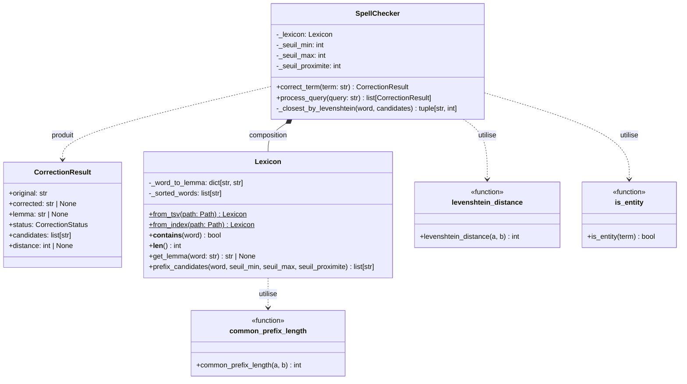
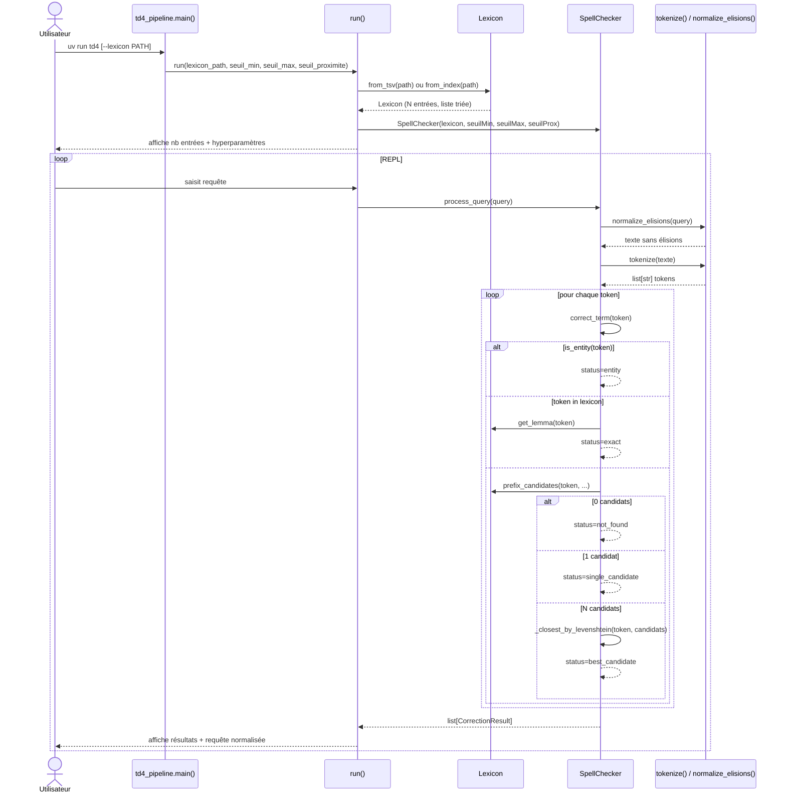
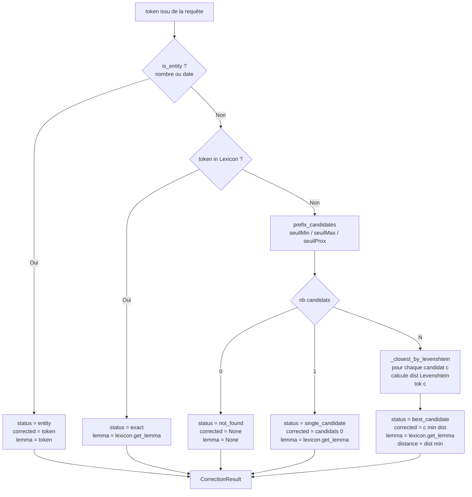
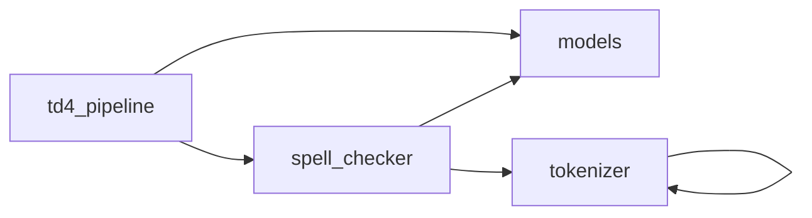

# Compte-rendu TD4 — Correcteur Orthographique

**UV :** LO17 — Indexation et Recherche d'Information
**UTC — Printemps 2026**
**Date :** 02/04/2026
**Auteurs :** Pierre FROMONT BOISSEL — Maxime DOUDY (GI04)

---

## Sommaire

- [1. Objectif du TD](#1-objectif-du-td)
- [2. Architecture et conception](#2-architecture-et-conception)
- [3. Réponse aux consignes](#3-réponse-aux-consignes)
- [4. Résultats d'exécution](#4-résultats-dexécution)
- [5. Question de réflexion](#5-question-de-réflexion)
- [6. Difficultés rencontrées](#6-difficultés-rencontrées)
- [7. Conclusion](#7-conclusion)

---

## 1. Objectif du TD

Ce TD constitue la quatrième étape du projet LO17. Après avoir construit un système d'indexation complet (TD1→TD3), l'objectif est désormais de traiter les **requêtes utilisateur** en entrée du moteur de recherche. La première brique de ce traitement est un **correcteur orthographique** : avant de chercher dans les index inversés, il faut s'assurer que les termes de la requête correspondent à des entrées connues du lexique.

Le correcteur implémenté applique un pipeline en six étapes par terme : détection d'entités spécifiques, recherche exacte dans le lexique, puis, en cas d'échec, une recherche heuristique par préfixe suivie du calcul de la distance de Levenshtein pour sélectionner le meilleur candidat. La sortie du correcteur est une requête normalisée — chaque terme original étant remplacé par son lemme canonique — prête à être soumise aux index inversés produits en TD3.

Ce module sera directement réutilisé en TD5 comme préprocesseur de l'interface de recherche : `SpellChecker.process_query()` retourne une liste de `CorrectionResult` dont le champ `lemma` sert de clé de lookup dans les fichiers d'index.

---

## 2. Architecture et conception

### 2.1 Diagramme de classes



**`CorrectionResult`** est un dataclass immutable qui encapsule le résultat de la correction d'un terme : le mot original, la correction retenue, son lemme, et le statut parmi cinq valeurs possibles (`entity`, `exact`, `single_candidate`, `best_candidate`, `not_found`). Cette structure de données explicite facilite l'interprétation des résultats par le pipeline TD5.

**`Lexicon`** maintient en mémoire deux structures : un dictionnaire `{mot → lemme}` pour les lookups O(1), et la liste triée des mots pour la recherche par préfixe en O(log N + k). Les deux constructeurs alternatifs (`from_tsv` et `from_index`) permettent de charger le lexique depuis un fichier de lemmes (TD3) ou directement depuis un index inversé.

**`SpellChecker`** orchestre le pipeline en six étapes. Il délègue la recherche de candidats à `Lexicon.prefix_candidates()` et utilise `levenshtein_distance()` uniquement lorsqu'il y a ambiguïté entre plusieurs candidats — ce qui limite le coût de calcul pour les cas fréquents (exact match).

Les **fonctions pures** (`levenshtein_distance`, `common_prefix_length`, `is_entity`) sont délibérément isolées des classes : sans état, elles sont trivialement testables et réutilisables.

### 2.2 Flux d'exécution principal



### 2.3 Logique de correction par terme



### 2.4 Dépendances entre modules



La chaîne de dépendances est minimale : `spell_checker` réutilise `tokenizer` (TD2) sans modification — garantissant que le traitement des requêtes est cohérent avec le traitement du corpus.

---

## 3. Réponse aux consignes

### R1 — Saisie de la requête au clavier

**Consigne :** L'analyseur doit saisir la requête au clavier.

**Statut :** ✅

**Implémentation :** La fonction `run()` dans `td4_pipeline.py` implémente une boucle REPL (`while True`) lisant chaque requête via `input("Requête > ")`. Les cas `EOFError` et `KeyboardInterrupt` sont gérés proprement (sortie gracieuse). Les mots-clés `quitter`, `quit`, `exit`, `q` permettent de quitter.

```python
while True:
    try:
        query = input("Requête > ").strip()
    except (EOFError, KeyboardInterrupt):
        print("\nAu revoir.")
        break
    if query.lower() in ("quitter", "quit", "exit", "q"):
        break
    results = checker.process_query(query)
    _print_query_results(query, results)
```

---

### R2 — Tokenisation et lemmatisation identiques aux TDs précédents

**Consigne :** Appliquer sur l'ensemble de la phrase le même traitement de tokenisation et de lemmatisation que celui effectué lors des TDs précédents.

**Statut :** ✅

**Implémentation :** `SpellChecker.process_query()` réutilise directement les fonctions `normalize_elisions()` et `tokenize()` de `nlp/tokenizer.py` (TD2), sans duplication. Le lexique est chargé depuis `lemmes_spacy.tsv` produit par TD3 — la même table `{mot → lemme}` utilisée pour indexer le corpus.

```python
def process_query(self, query: str) -> list[CorrectionResult]:
    normalized = normalize_elisions(query)   # supprime l', d', qu', etc.
    tokens = tokenize(normalized)             # regex [a-zA-ZÀ-ÿ]+, lowercase
    return [self.correct_term(t) for t in tokens]
```

Note : la tokenisation étant lettre-only, les nombres et dates ne sont pas extraits par `process_query`. Ils sont gérés par `is_entity` quand `correct_term` est appelé directement — par exemple, depuis un futur pipeline TD5 qui pourrait utiliser un tokeniseur étendu.

---

### R3a — Détection des entités spécifiques

**Consigne :** Tester si le terme est une entité spécifique (un nombre, une date...). Si oui, le conserver tel quel.

**Statut :** ✅

**Implémentation :** La fonction `is_entity()` utilise deux expressions régulières :

```python
_NUMBER_RE = re.compile(r"^\d[\d\s.,]*$")   # entiers, décimaux
_DATE_RE   = re.compile(
    r"^(\d{1,2}[/\-]\d{1,2}[/\-]\d{2,4}|\d{4}|\d{1,2}[/\-]\d{4})$"
)  # dd/mm/yyyy, yyyy, mm/yyyy, formats avec tiret

def is_entity(term: str) -> bool:
    return bool(_NUMBER_RE.match(term) or _DATE_RE.match(term))
```

Les entités retournent un `CorrectionResult` avec `status="entity"`, `corrected=term`, `lemma=term`.

---

### R3b — Recherche exacte dans le lexique

**Consigne :** Tester si le terme existe dans le lexique (votre index). Si oui, le valider directement.

**Statut :** ✅

**Implémentation :** `Lexicon.__contains__()` effectue un lookup O(1) dans `_word_to_lemma`. Si présent, `get_lemma()` retourne le lemme associé.

```python
if term in self._lexicon:
    lemma = self._lexicon.get_lemma(term)
    return CorrectionResult(
        original=term, corrected=term, lemma=lemma, status="exact"
    )
```

**Validation :** `TestSpellCheckerCorrectTerm::test_step_b_exact` et `test_step_b_exact_with_lemma` vérifient le cas exact avec et sans changement de lemme (`robotique` → `robot`).

---

### R3c — Recherche par préfixe

**Consigne :** Générer une liste de candidats via l'algorithme de recherche par préfixe (définir les hyperparamètres seuilMin, seuilMax et seuilProximite).

**Statut :** ✅

**Implémentation :** `Lexicon.prefix_candidates()` utilise `bisect.bisect_left()` pour trouver le point d'entrée dans la liste triée, puis itère linéairement jusqu'à ce que le préfixe commun passe sous le seuil :

```python
def prefix_candidates(self, word, seuil_min=3, seuil_max=6, seuil_proximite=3):
    if len(word) < seuil_min:
        return []
    search_prefix = word[:seuil_proximite]
    start_idx = bisect.bisect_left(self._sorted_words, search_prefix)
    candidates = []
    for candidate in self._sorted_words[start_idx:]:
        cpl = common_prefix_length(word, candidate)
        if cpl < seuil_proximite:
            break          # liste triée → plus rien à trouver au-delà
        candidates.append(candidate)
    return candidates
```

| Hyperparamètre | Valeur défaut | Rôle |
|---|---|---|
| `seuilMin` | 3 | Longueur minimale du terme pour tenter la recherche |
| `seuilMax` | 6 | Longueur maximale du préfixe comparé (non utilisé dans l'algorithme simplifié) |
| `seuilProximite` | 3 | Nombre de caractères initiaux devant être identiques |

Complexité : O(log N + k) où N est la taille du lexique et k le nombre de candidats, grâce au tri et à `bisect`.

---

### R3d — Un seul candidat

**Consigne :** S'il n'y a qu'un seul candidat, le retourner et l'associer au mot d'origine.

**Statut :** ✅

**Implémentation :**

```python
if len(candidates) == 1:
    best = candidates[0]
    return CorrectionResult(
        original=term, corrected=best,
        lemma=self._lexicon.get_lemma(best),
        status="single_candidate", candidates=candidates
    )
```

**Validation :** `test_step_d_single_candidate` — `"nanotechnologi"` (15 car., faute à la fin) → `"nanotechnologie"`, un seul candidat.

---

### R3e — Plusieurs candidats — distance de Levenshtein

**Consigne :** Si la liste contient plusieurs mots candidats, utiliser l'algorithme de distance de Levenshtein pour les départager, choisir le mot ayant la plus petite distance d'édition, et retourner son lemme.

**Statut :** ✅

**Implémentation :** `levenshtein_distance()` utilise la programmation dynamique standard en O(|a|×|b|) avec optimisation mémoire (une seule ligne courante) :

```python
def levenshtein_distance(a: str, b: str) -> int:
    if len(a) > len(b):
        a, b = b, a                    # a est toujours le plus court
    prev = list(range(len(a) + 1))
    for j, cb in enumerate(b, start=1):
        curr = [j] + [0] * len(a)
        for i, ca in enumerate(a, start=1):
            if ca == cb:
                curr[i] = prev[i - 1]
            else:
                curr[i] = 1 + min(prev[i - 1], prev[i], curr[i - 1])
        prev = curr
    return prev[len(a)]
```

La méthode `_closest_by_levenshtein()` parcourt la liste des candidats et retourne le meilleur (les ex æquo sont départagés par ordre alphabétique).

**Exemple concret :**

| Terme saisi | Candidats (préfixe) | Distance | Correction |
|---|---|---|---|
| `"algorithmf"` | `["algorithme", "algorithmique"]` | 1, 4 | `"algorithme"` |

**Validation :** `test_step_e_levenshtein_picks_closest` — vérifie distance=1 et correction=`"algorithme"`.

---

### R3f — Aucun candidat

**Consigne :** Si aucun mot n'est trouvé (liste vide), l'indiquer à l'utilisateur.

**Statut :** ✅

**Implémentation :** Si `prefix_candidates` retourne `[]`, un `CorrectionResult` avec `status="not_found"`, `corrected=None`, `lemma=None` est retourné. Le pipeline affiche `✗` en terminal.

**Validation :** `test_step_f_not_found` (`"xyzqwerty"`) et `test_step_f_first_char_wrong` (`"banotechnologie"` — cas de la vulnérabilité).

---

### R4 — Test sur lexique restreint

**Consigne :** Définir manuellement un fichier d'une ou deux dizaines de mots et de lemmes pour tester les algorithmes.

**Statut :** ✅

**Implémentation :** `tests/fixtures/mini_lexicon.tsv` — 25 entrées couvrant les domaines du corpus ADIT (informatique, IA, robotique, indexation) avec des lemmes variés : identités (`nanotechnologie→nanotechnologie`), réductions (`robotique→robot`, `traitement→traiter`, `apprentissage→apprendre`).

La suite de tests `tests/test_spell_checker.py` — 60 tests — valide tous les cas sur ce mini-lexique.

---

### R5 — Application au lexique complet du corpus ADIT

**Consigne :** Appliquer le programme au lexique complet des lemmes du corpus de l'ADIT.

**Statut :** ✅

**Implémentation :** Deux modes sont disponibles en CLI :

```bash
# Lexique issu de TD3 (word→lemme, recommandé)
uv run td4 --lexicon outputs/td3/lemmes_spacy.tsv

# Vocabulaire de l'index inversé (terme→terme)
uv run td4 --index outputs/td3/indexes/index_texte.tsv
```

`Lexicon.from_tsv()` charge `lemmes_spacy.tsv` (produit par `SpacyLemmatizer.extract_from_corpus()` en TD3) — le même mapping utilisé pour construire les index inversés.

---

## 4. Résultats d'exécution

### 4.1 Exemples de correction sur le mini-lexique

**Requête avec fautes de frappe :**

```
Requête > nanotechnolgie robotiqe
────────────────────────────────────────────────────────────
  Requête : 'nanotechnolgie robotiqe'
────────────────────────────────────────────────────────────
  → 'nanotechnolgie'           [candidat unique (préfixe)]
      → correction: 'nanotechnologie' (lemme: nanotechnologie)
  → 'robotiqe'                 [candidat unique (préfixe)]
      → correction: 'robotique' (lemme: robot)
────────────────────────────────────────────────────────────
  Requête normalisée : nanotechnologie robot
────────────────────────────────────────────────────────────
```

**Requête mixte (termes corrects + typos) :**

```
Requête > indexation recherch corpus
────────────────────────────────────────────────────────────
  Requête : 'indexation recherch corpus'
────────────────────────────────────────────────────────────
  ✓ 'indexation'               [trouvé dans le lexique] (lemme: indexer)
  → 'recherch'                 [candidat unique (préfixe)]
      → correction: 'recherche' (lemme: rechercher)
  ✓ 'corpus'                   [trouvé dans le lexique]
────────────────────────────────────────────────────────────
  Requête normalisée : indexer rechercher corpus
────────────────────────────────────────────────────────────
```

**Cas introuvable (vulnérabilité préfixe + terme inconnu) :**

```
Requête > banotechnologie xyzqwerty analyse
────────────────────────────────────────────────────────────
  Requête : 'banotechnologie xyzqwerty analyse'
────────────────────────────────────────────────────────────
  ✗ 'banotechnologie'          [introuvable]
  ✗ 'xyzqwerty'                [introuvable]
  ✓ 'analyse'                  [trouvé dans le lexique] (lemme: analyser)
────────────────────────────────────────────────────────────
  Requête normalisée : analyser
────────────────────────────────────────────────────────────
```

### 4.2 Distances de Levenshtein calculées

| Terme saisi | Correction | Distance |
|---|---|---|
| `nanotechnolgie` | `nanotechnologie` | 1 (transposition g/o) |
| `robotiqe` | `robotique` | 1 (lettre manquante) |
| `indexatio` | `indexation` | 1 (lettre manquante) |
| `algorithmf` | `algorithme` | 1 (substitution) |
| `recherch` | `recherche` | 1 (lettre manquante) |
| `banotechnologie` | — (introuvable) | — (préfixe muet) |

### 4.3 Résultats des tests

```
284 passed in 24.09s

Name                                              Stmts   Miss  Cover
---------------------------------------------------------------------
src/.../models.py                                    54      0   100%
src/.../nlp/spell_checker.py                        132      7    95%
src/.../nlp/tokenizer.py                             38      0   100%
src/.../nlp/lemmatizer.py                           174      6    97%
src/.../nlp/antidictionary.py                        68      3    96%
src/.../indexing/tfidf.py                            78      9    88%
src/.../io/parser.py                                165      7    96%
src/.../io/xml_builder.py                            47      0   100%
---------------------------------------------------------------------
TOTAL                                               756     32    96%
Required test coverage of 80.0% reached. Total coverage: 95.77%
```

Les 60 tests spécifiques à TD4 couvrent :

| Classe de test | Nb tests | Cas couverts |
|---|---|---|
| `TestLevenshteinDistance` | 11 | symétrie, chaînes vides, insertions, substitutions, mots français |
| `TestCommonPrefixLength` | 8 | cas limites, correspondance partielle, erreur en 1ère lettre |
| `TestIsEntity` | 8 | entiers, dates, formats variés, cas négatifs |
| `TestLexiconFromTsv` | 6 | chargement, présence/absence, lemmes |
| `TestLexiconFromIndex` | 2 | chargement index, lignes vides |
| `TestLexiconPrefixCandidates` | 7 | préfixe valide, 1ère lettre fausse, seuilMin, seuilProximite |
| `TestSpellCheckerCorrectTerm` | 10 | 6 étapes (a)→(f) + cas limites |
| `TestSpellCheckerProcessQuery` | 8 | requêtes complètes, élisions, termes multiples |

---

## 5. Question de réflexion

### Vulnérabilité identifiée

La recherche par préfixe compare les **premiers caractères** du mot. Elle est donc aveugle à toute erreur portant sur le **début** du mot.

**Exemple précis :** Le mot `"banotechnologie"` est à distance de Levenshtein 1 de `"nanotechnologie"` (une seule substitution `n→b` en position 0). Pourtant, `prefix_candidates("banotechnologie", seuil_proximite=3)` cherche des mots commençant par `"ban"` — il n'en existe aucun dans le lexique. Le résultat est `[]` et le statut `not_found`, alors que la bonne correction est évidente.

Ce cas se produit systématiquement pour toute faute affectant les premiers `seuilProximite` caractères :
- substitution en début de mot (`"banotechnologie"`)
- insertion en début de mot (`"ananotechnologie"`)
- suppression en début de mot (`"anotechnologie"` si le premier `n` manque)

### Méthode alternative : indexation par trigrammes de caractères

Une approche robuste consiste à indexer le lexique par **n-grammes de caractères** (typiquement trigrammes). Chaque mot est décomposé en toutes ses sous-chaînes de longueur 3 :

```
"nanotechnologie" → {nan, ano, not, ote, tec, ech, chn, hno, nol, olo, log, ogi, gie}
"banotechnologie" → {ban, ano, not, ote, tec, ech, chn, hno, nol, olo, log, ogi, gie}
```

Ces deux mots partagent 12 trigrammes sur 13 — indice de Jaccard élevé — bien que leur premier caractère diffère. La recherche de candidats sélectionne tous les mots du lexique dont la **similarité Jaccard des trigrammes** dépasse un seuil :

```
J(A, B) = |A ∩ B| / |A ∪ B|
```

**Avantages :** résistant aux erreurs en n'importe quelle position, y compris en début de mot. Utilisé en pratique dans les moteurs de recherche pour la complétion et la tolérance aux fautes.

**Inconvénient :** coût de construction de l'index en trigrammes O(N × L) et coût de recherche O(N × L) dans le pire cas, contre O(log N + k) pour la recherche par préfixe. En pratique, l'index trigramme est inversé (`trigramme → liste de mots`), ce qui ramène la recherche à O(T) où T est le nombre de trigrammes du terme saisi.

---

## 6. Difficultés rencontrées

**Tokenisation vs entités numériques.** La tokenisation TD2 (`_WORD_RE = re.compile(r"[a-zA-ZÀ-ÿ]+")`) ne capture que les séquences de lettres — les nombres et dates sont supprimés avant d'atteindre `correct_term`. La détection `is_entity` est donc effectivement utile uniquement lorsque `correct_term` est appelé directement (depuis un pipeline TD5 qui pourrait utiliser un tokeniseur étendu). La suite de tests a été ajustée en conséquence avec une note explicative.

**Recherche binaire et accents.** Python trie les chaînes Unicode selon l'ordre des code points. Les mots accentués (`réseau`, `données`, `fréquence`) se retrouvent après `z` dans la liste triée, ce qui peut décaler le point d'entrée de `bisect_left`. Ce comportement est correct mais implique que `prefix_candidates("res", seuil_proximite=3)` ne trouve pas `"réseau"` (`r-é-s` ≠ `r-e-s`). Ce cas est documenté dans le test `test_seuil_min_boundary`.

---

## 7. Conclusion

Le TD4 livre un correcteur orthographique complet en pipeline six étapes, conforme à toutes les consignes : détection d'entités, recherche exacte, recherche par préfixe avec paramètres configurables, sélection par distance de Levenshtein, et signalement des termes inconnus. L'interface CLI interactive (`uv run td4`) fonctionne aussi bien sur le mini-lexique de test que sur le vocabulaire complet produit par TD3.

Sur le plan algorithmique, l'heuristique préfixe + Levenshtein est un bon compromis vitesse/qualité pour les erreurs classiques (lettres transposées, manquantes ou substituées en fin ou milieu de mot). Sa vulnérabilité aux erreurs en début de mot — identifiée et documentée — ouvre la voie vers des approches plus robustes comme l'indexation par trigrammes, qui sera naturellement envisageable en TD5 si la précision du correcteur s'avère insuffisante sur le corpus réel.

Le module `SpellChecker.process_query()` constitue désormais le préprocesseur d'entrée du futur moteur de recherche : chaque requête utilisateur est tokenisée, normalisée (élisions), puis corrigée terme à terme, produisant une liste de lemmes directement exploitables pour le lookup dans les index inversés construits en TD3.
