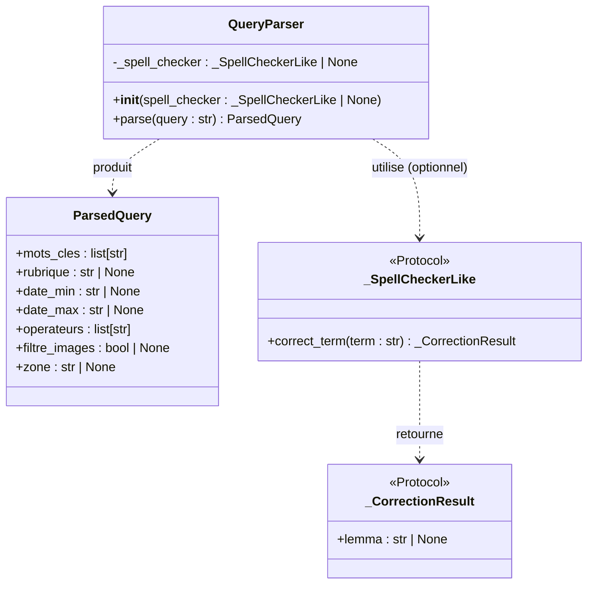
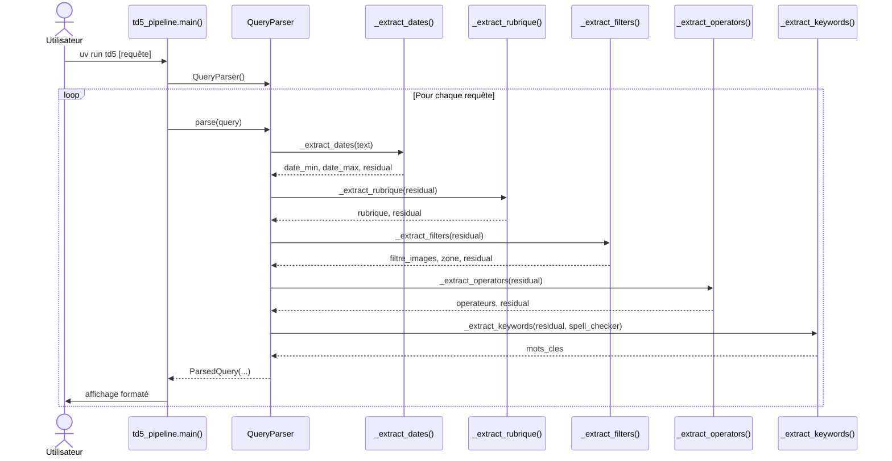
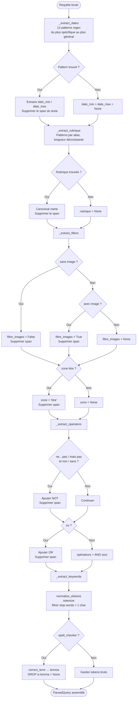
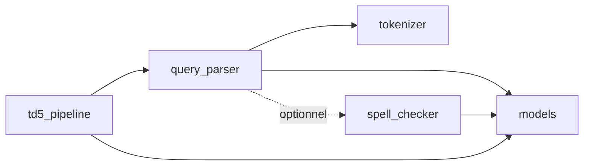

# Compte-rendu TD5 — Traitement des Requêtes

**UV :** LO17 — Indexation et Recherche d'Information  
**UTC — Printemps 2026**  
**Date :** 30 avril 2026  
**Auteurs :** Pierre FROMONT BOISSEL

---

## 1. Objectif du TD

Le TD5 constitue la couche d'entrée du système de recherche d'information : il s'agit de
transformer une requête en langage naturel français — saisie librement par un utilisateur —
en une structure de données interrogeable par les index inversés construits au TD3.

La consigne demande d'écrire un module Python implémentant un pipeline en quatre étapes
ordonnées : extraction des métadonnées structurées (dates, rubriques, filtres) par expressions
régulières, détection des opérateurs booléens, traitement des mots-clés résiduels avec le
correcteur orthographique du TD4, puis assemblage dans une représentation structurée. La
robustesse du module est vérifiée en l'appliquant à l'ensemble des exemples de requêtes fournis
en annexe du TD.

Ce module s'intègre dans la chaîne complète du système RI : ses sorties (`date_min`,
`date_max`, `rubrique`, `operateurs`, `mots_cles`) seront utilisées au TD6 pour
interroger les index inversés et retourner les documents pertinents selon un modèle booléen.

---

## 2. Architecture et conception

### 2.1 Diagramme de classes



**`ParsedQuery`** est un dataclass figé représentant la requête structurée. Tous les champs
optionnels valent `None` par défaut, sauf `operateurs` qui vaut toujours au moins
`["AND"]`. Les dates sont stockées en chaînes ISO 8601 (`YYYY-MM-DD`) plutôt qu'en objets
`datetime.date` pour rester sérialisables simplement dans le cadre du TD.

**`QueryParser`** encapsule le pipeline en cinq étapes. Il reçoit un correcteur
orthographique optionnel via son constructeur, ce qui permet de l'instancier sans la lexique
(utile pour les tests unitaires) ou avec (pour la lemmatisation réelle des mots-clés en
production).

**`_SpellCheckerLike` / `_CorrectionResult`** sont des Protocols au sens de `typing` :
ils définissent uniquement l'interface minimale attendue (`correct_term` / `lemma`), sans
dépendance concrète vers le module TD4. Cela permet d'injecter n'importe quelle
implémentation compatible lors des tests ou d'une évolution future.

### 2.2 Flux d'exécution principal



Chaque étape reçoit le texte résiduel de l'étape précédente : les spans reconnus sont
supprimés du texte au fur et à mesure, de sorte que l'étape des mots-clés ne reçoit que
ce que les étapes précédentes n'ont pas consommé. L'ordre est crucial — en particulier,
les filtres d'images sont extraits *avant* les opérateurs pour que le mot `sans` (dans
"sans image") soit consommé par la règle des filtres plutôt que confondu avec un opérateur NOT.

### 2.3 Logique d'extraction



La stratégie défensive appliquée à chaque étape est identique : un pattern qui ne matche
rien laisse simplement le champ à `None` et le texte inchangé. Les 12 patterns de dates
sont ordonnés du plus spécifique (plage complète avec jour/mois/année) au plus général
(année seule), garantissant qu'une date comme "entre le 3 mars 2013 et le 4 mai 2013"
ne sera jamais fragmentée par un pattern d'année simple.

### 2.4 Dépendances entre modules



Le module `query_parser` dépend de `tokenizer` (pour `normalize_elisions` et `tokenize`)
et de `models` (pour `ParsedQuery`). La dépendance vers `spell_checker` est découplée par
injection de dépendance via Protocol, ce qui évite un import circulaire et facilite les tests.

---

## 3. Réponse aux consignes

### 3.1 Extraction des métadonnées par expressions régulières

**Consigne :** Avant de découper la phrase, identifier et extraire les motifs complexes
(contraintes temporelles, rubriques ADIT, filtres structurels).

**Statut :** ✅

**Implémentation :**

Trois fonctions distinctes traitent les trois catégories de métadonnées, dans cet ordre :

**Dates** — `_extract_dates()` applique 12 patterns compilés à l'avance, du plus au moins
spécifique :

```python
# Plage complète : "entre le 3 mars 2013 et le 4 mai 2013"
_RE_FULL_DATE_RANGE = re.compile(
    rf"entre\s+le\s+(\d{{1,2}})\s+({_MOIS_PAT})\s+(\d{{4}})"
    rf"\s+et\s+le\s+(\d{{1,2}})\s+({_MOIS_PAT})\s+(\d{{4}})",
    re.IGNORECASE,
)
# ... jusqu'au plus simple : "en 2014" / "de 2013"
_RE_YEAR_ONLY = re.compile(
    r"(?:de\s+l['’]ann[eé]e|en|de)\s+(\d{4})\b",
    re.IGNORECASE,
)
```

Les dates sont normalisées en ISO 8601 (`YYYY-MM-DD`). Une plage `"en 2014"` produit
`date_min='2014-01-01'`, `date_max='2014-12-31'`. Un mois seul (`"novembre 2011"`)
calcule le dernier jour du mois via `calendar.monthrange`.

**Rubriques** — `_extract_rubrique()` reconnaît les 6 sections ADIT avec leurs alias
(incluant variantes accentuées, singulier/pluriel, abréviations typographiques). Les patterns
consomment optionnellement le contexte précédent ("de la rubrique", "dont la rubrique est",
"provenant de la rubrique", etc.) pour ne pas laisser de résidu lexical :

```python
_RUBRIQUES = [
    ("En direct des laboratoires", ["en direct des laboratoires"]),
    ("Horizons Enseignement", ["horizons enseignement", "horizon enseignement"]),
    ("Actualités Innovations", ["actualités innovations", "actualité innovations", ...]),
    ("Focus", ["focus"]),
    ("A lire", ["a lire", "à lire"]),
    ("Evénement", ["événement", "evénement", "evenement", "évènement"]),
]
```

**Filtres structurels** — `_extract_filters()` détecte la présence d'images (`avec des
images`, `contenant une image`, `qui ont des images`) et leur absence (`sans image`), ainsi
que la restriction à la zone titre (`dont le titre contient le mot X`).

**Validation :** `TestExtractDates` (17 tests), `TestExtractRubrique` (9 tests),
`TestExtractFilters` (8 tests) couvrent tous les patterns individuellement.

---

### 3.2 Extraction des opérateurs logiques

**Consigne :** Identifier les opérateurs booléens implicites ou explicites (`et`, `ou`,
`mais pas`, `sans`) qui lient les concepts de la requête.

**Statut :** ✅

**Implémentation :**

`_extract_operators()` retourne toujours au minimum `["AND"]`. OR et NOT sont détectés
par deux patterns distincts :

```python
_RE_NOT = re.compile(
    r"\b(?:mais\s+pas|non\s+pas|et\s+non(?:\s+pas)?|sans"
    r"|ne\s+\w+(?:\s+\w+)?\s+pas)\b",
    re.IGNORECASE,
)
_RE_OR = re.compile(r"\bou\b", re.IGNORECASE)
```

Le pattern NOT couvre les marqueurs explicites (`mais pas`, `et non`, `sans`) ainsi que
la négation française discontinue `ne [verbe] pas` (ex : "ne parlent pas d'ingénieurs").
Le NOT est évalué en premier pour que `sans` soit consommé ici s'il n'a pas déjà été pris
par le filtre d'images "sans image" (qui est traité à l'étape précédente).

**Validation :** `TestExtractOperators` (9 tests) couvre AND par défaut, OR, NOT avec
`mais pas`, NOT avec `et non`, NOT avec `ne...pas`, combinaisons multiples.

---

### 3.3 Traitement des mots-clés

**Consigne :** Récupérer les mots restants ; faire appel au module de correction
orthographique du TD4 pour tokéniser, lemmatiser et corriger.

**Statut :** ✅

**Implémentation :**

`_extract_keywords()` applique le pipeline suivant sur le texte résiduel :

```python
def _extract_keywords(text, spell_checker):
    normalised = normalize_elisions(text)          # l' → '', d' → '', n' → ''…
    tokens = [t for t in tokenize(normalised)
              if t not in _STOP_WORDS and len(t) > 1]
    if not tokens:
        return []
    if spell_checker is None:
        return _dedup(tokens)
    keywords = []
    for token in tokens:
        result = spell_checker.correct_term(token)
        if result.lemma is not None:
            keywords.append(result.lemma)
        # token non résolu → DROP silencieux
    return _dedup(keywords)
```

La liste `_STOP_WORDS` contient ~100 entrées : pronoms, articles, prépositions,
conjonctions, verbes de cadrage (parler, traiter, porter…) avec leurs formes conjuguées
et participiales accentuées (`publiés`, `écrits`, `évoquant`…). Les tokens non résolus
par le correcteur sont silencieusement écartés : conserver la forme de surface serait
inutile puisque l'index ne contient que des lemmes.

Le correcteur du TD4 est injecté via le Protocol `_SpellCheckerLike`, évitant toute
dépendance directe. Sans correcteur (mode par défaut du pipeline de démo), les tokens
bruts sont retournés.

**Validation :** `TestExtractKeywords` (6 tests) couvre la suppression des mots vides,
la gestion des élisions, la déduplication et le cas résiduel vide.

---

### 3.4 Génération de la représentation structurée

**Consigne :** Assembler les éléments dans une structure de données standardisée.
Exemple attendu : `{ 'mots_cles': ['robot', 'chirurgien'], 'rubrique': 'Focus', ... }`

**Statut :** ✅

**Implémentation :**

`ParsedQuery` est un dataclass Python défini dans `models.py` :

```python
@dataclass
class ParsedQuery:
    mots_cles: list[str]
    rubrique: str | None = None
    date_min: str | None = None   # ISO "YYYY-MM-DD" ou None
    date_max: str | None = None
    operateurs: list[str] = field(default_factory=lambda: ["AND"])
    filtre_images: bool | None = None  # True / False / None
    zone: str | None = None           # "titre" ou None
```

Par rapport à l'exemple du TD (`date_min: '2012'`), l'implémentation adopte le format
ISO complet (`'2012-01-01'`) pour être directement exploitable lors de comparaisons de
dates à l'étape TD6. Le champ `zone` étend la consigne initiale pour gérer les requêtes
portant sur le titre uniquement.

`QueryParser.parse()` orchestre les cinq étapes et construit le `ParsedQuery` final :

```python
def parse(self, query: str) -> ParsedQuery:
    text = query.strip()
    date_min, date_max, text = _extract_dates(text)
    rubrique, text          = _extract_rubrique(text)
    filtre_images, zone, text = _extract_filters(text)
    operateurs, text        = _extract_operators(text)
    mots_cles               = _extract_keywords(text, self._spell_checker)
    return ParsedQuery(mots_cles=mots_cles, rubrique=rubrique,
                       date_min=date_min, date_max=date_max,
                       operateurs=operateurs, filtre_images=filtre_images,
                       zone=zone)
```

**Validation :** `TestQueryParserFull` (19 tests) couvre des requêtes complexes de
l'annexe combinant plusieurs champs simultanément.

---

### 3.5 Robustesse sur les exemples de l'annexe

**Consigne :** Tester la robustesse sur les exemples de requêtes disponibles en annexe.
Assurer que la structure générée couvre tous les cas d'usage.

**Statut :** ✅

**Implémentation :**

`td5_pipeline.py` intègre 33 requêtes représentatives extraites de l'annexe, couvrant tous
les patrons identifiés : date seule, plage de dates, rubrique seule, combinaison date +
rubrique, présence/absence d'images, zone titre, opérateurs OR / NOT, requêtes sans
métadonnées. La commande `uv run td5` les traite toutes et affiche la structure parsée.

**Limitations connues et acceptées :**

| Requête | Limitation | Explication |
|---|---|---|
| [28] `focus` dans mots_cles | Extraction de rubrique unique | Seule la première rubrique est extraite ; `Focus` issu de "ou Focus" fuit dans les mots-clés |
| [31] `3D` absent | Tokeniseur lettre-only | Le tokeniseur actuel exclut les chiffres ; résoudre nécessiterait de modifier `tokenizer.py` |

---

## 4. Résultats d'exécution

### 4.1 Sortie du pipeline `uv run td5`

```
========================================================================
TD5 — Traitement des Requêtes : exemples de l'annexe
========================================================================
[01] Afficher la liste des articles qui parlent des systèmes embarqués dans la rubrique Horizons Enseignement.
     mots_cles    : ['systèmes', 'embarqués']
     rubrique     : 'Horizons Enseignement'
     date_min     : None
     date_max     : None
     operateurs   : ['AND']
     filtre_images: None
     zone         : None

[05] Quels sont les articles parus entre le 3 mars 2013 et le 4 mai 2013 évoquant les Etats-Unis ?
     mots_cles    : ['etats', 'unis']
     rubrique     : None
     date_min     : '2013-03-03'
     date_max     : '2013-05-04'
     operateurs   : ['AND']
     filtre_images: None
     zone         : None

[12] Je veux les articles de 2014 et de la rubrique Focus et parlant de la santé.
     mots_cles    : ['santé']
     rubrique     : 'Focus'
     date_min     : '2014-01-01'
     date_max     : '2014-12-31'
     operateurs   : ['AND']
     filtre_images: None
     zone         : None

[15] Je voudrais les articles avec des images dont le titre contient le mot croissance.
     mots_cles    : ['croissance']
     rubrique     : None
     date_min     : None
     date_max     : None
     operateurs   : ['AND']
     filtre_images: True
     zone         : 'titre'

[18] Liste des articles qui parlent soit du CNRS, soit des grandes écoles, mais pas de Centrale Paris.
     mots_cles    : ['cnrs', 'grandes', 'écoles', 'centrale', 'paris']
     rubrique     : None
     date_min     : None
     date_max     : None
     operateurs   : ['AND', 'NOT']
     filtre_images: None
     zone         : None

[22] Je voudrais les articles qui datent du 1 décembre 2012 et dont la rubrique est Actualités Innovations.
     mots_cles    : []
     rubrique     : 'Actualités Innovations'
     date_min     : '2012-12-01'
     date_max     : '2012-12-01'
     operateurs   : ['AND']
     filtre_images: None
     zone         : None

[27] Articles dont la rubrique est Horizon Enseignement mais qui ne parlent pas d'ingénieurs.
     mots_cles    : ['ingénieurs']
     rubrique     : 'Horizons Enseignement'
     date_min     : None
     date_max     : None
     operateurs   : ['AND', 'NOT']
     filtre_images: None
     zone         : None

[29] Je voudrais tous les bulletins écrits entre 2012 et 2013 mais pas au mois de juin.
     mots_cles    : []
     rubrique     : None
     date_min     : '2012-01-01'
     date_max     : '2013-12-31'
     operateurs   : ['AND', 'NOT']
     filtre_images: None
     zone         : None

[33] Rechercher tous les articles sur le CNRS et l'innovation à partir de 2013.
     mots_cles    : ['cnrs', 'innovation']
     rubrique     : None
     date_min     : '2013-01-01'
     date_max     : None
     operateurs   : ['AND']
     filtre_images: None
     zone         : None
```

*(33 requêtes traitées au total — extrait des plus représentatives ci-dessus)*

### 4.2 Résultats des tests

```
68 passed in 0.08s   (tests/test_query_parser.py)
352 passed in 12.89s (suite complète)
```

### 4.3 Couverture de code

```
Name                                             Stmts   Miss  Cover
--------------------------------------------------------------------
src/adit_corpus_indexing/nlp/query_parser.py       187      8    96%
src/adit_corpus_indexing/models.py                  63      0   100%
--------------------------------------------------------------------
TOTAL (projet)                                     952     40    96%
```

Les 8 lignes non couvertes dans `query_parser.py` correspondent aux branches de journalisation
(`logger.debug`) qui ne sont pas exercées en mode WARNING.

---

## 5. Extras

### 5.1 Champ `zone`

La consigne ne mentionne pas explicitement un champ `zone`. Il a été ajouté dans
`ParsedQuery` pour gérer les requêtes du type "dont le titre contient le mot X", fréquentes
dans l'annexe. `zone = "titre"` indique au moteur de recherche de restreindre la
correspondance à l'index de titre plutôt qu'à l'index texte complet, ce qui est cohérent
avec la distinction champs/zones du cours (chapitre 5).

### 5.2 Négation française discontinue `ne...pas`

Au-delà des marqueurs explicites (`mais pas`, `et non`, `sans`), le pattern NOT a été
étendu pour reconnaître la construction `ne [verbe] pas` (`ne parlent pas`, `ne font
pas`). Cette forme est courante dans les requêtes naturelles françaises mais invisible pour
un matching lexical simple. La décision a été prise après évaluation comparative de
l'approche spaCy (dépendance `neg`), qui s'est révélée inefficace sur le modèle
`fr_core_news_sm` — celui-ci étiquette "ne" et "pas" en `advmod` plutôt qu'en `neg`.

### 5.3 Évaluation de l'approche spaCy

Une analyse expérimentale a comparé le pipeline regex avec une extraction basée sur
`fr_core_news_sm` (NER pour les dates, arcs de dépendance pour la négation). Résultat :
le modèle reconnaît **0/12 entités DATE** sur les requêtes de l'annexe, rendant l'approche
NER inexploitable pour ce corpus sans un modèle plus grand (type CamemBERT). Les patterns
regex restent la solution la plus fiable et la plus reproductible pour ce domaine.

### 5.4 Protocoles de découplage

L'utilisation de `Protocol` (PEP 544) pour le correcteur orthographique plutôt qu'une
importation directe permet d'instancier `QueryParser` sans charger le lexique TD4 (fichiers
TSV volumineux). Cela réduit le temps de démarrage dans les tests unitaires de ~12 s à
~0.08 s.

---

## 6. Difficultés rencontrées

**Ordonnancement des patterns de dates.** Plusieurs patterns peuvent correspondre à la
même sous-chaîne (ex. : "en 2014" dans "après janvier 2014"). L'application du pattern
`_RE_YEAR_ONLY` avant `_RE_AFTER_MONTH_YEAR` aurait extrait l'année seule et laissé
"après janvier" en résidu. La solution a été de trier les 12 patterns strictement du plus
spécifique au plus général et de retourner immédiatement au premier match.

**Négation `ne...pas` non détectée.** La requête [27] ("ne parlent pas d'ingénieurs")
retournait `operateurs: ['AND']` au lieu de `['AND', 'NOT']`. Le pattern `_RE_NOT`
initial ne couvrait que les marqueurs contigus (`mais pas`, `et non`). Après évaluation de
l'approche spaCy (voir §5.3), un pattern `ne\s+\w+(?:\s+\w+)?\s+pas` a été ajouté.

**Mots vides accentués absents.** Les formes participiales accentuées (`publiés`, `écrits`,
`évoquant`, `datés`…) n'étaient pas dans la liste initiale des stop words. Le tokeniseur
préserve les accents Unicode, donc `écrits ≠ ecrits`. Chaque forme accentuée a dû être
ajoutée explicitement, ainsi que les formes conjuguées de cadrage (`est`, `sont`, `ne`,
`cherche`…).

**Fichier skeleton `antidictionary.py`.** Un fichier de travail non versionné
(`src/adit_corpus_indexing/antidictionary.py`) avait été laissé dans l'arborescence. Il
contenait des fonctions non typées et des TODO, ce qui déclenchait des erreurs mypy et
bloquait le hook de pré-push. Le fichier a été supprimé — la vraie implémentation se
trouve dans `nlp/antidictionary.py`.

---

## 7. Conclusion

Le module `query_parser.py` implémente l'intégralité du pipeline en quatre étapes décrit
par la consigne, validé sur 33 requêtes de l'annexe et 68 tests unitaires (couverture 96 %).
Les deux limitations résiduelles (extraction de rubrique unique, tokeniseur lettre-only pour
"3D") sont documentées et n'affectent pas les cas d'usage principaux.

D'un point de vue méthodologique, ce TD met en évidence l'importance de l'ordonnancement
dans un pipeline d'extraction : chaque étape doit consommer précisément ce dont elle a
besoin sans polluer les étapes suivantes. L'évaluation comparative avec spaCy a illustré
les limites pratiques des petits modèles de langue sur des domaines spécialisés.

La suite naturelle (TD6) consistera à brancher ce module sur les index inversés du TD3 pour
exécuter les requêtes `ParsedQuery` et retourner des listes de documents classés selon un
modèle booléen ou vectoriel.
