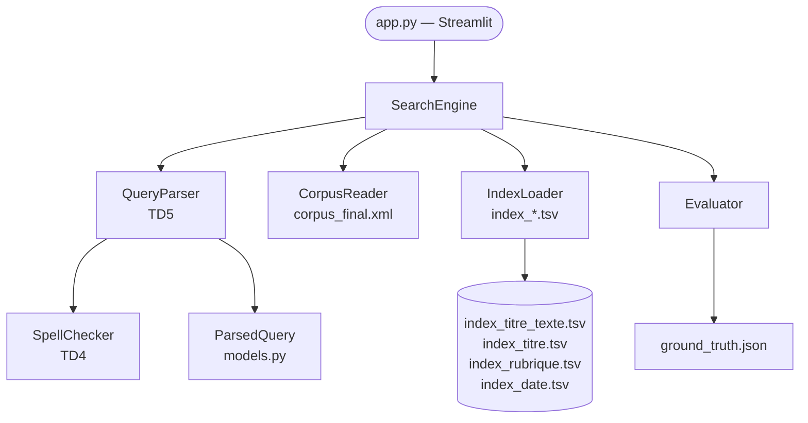
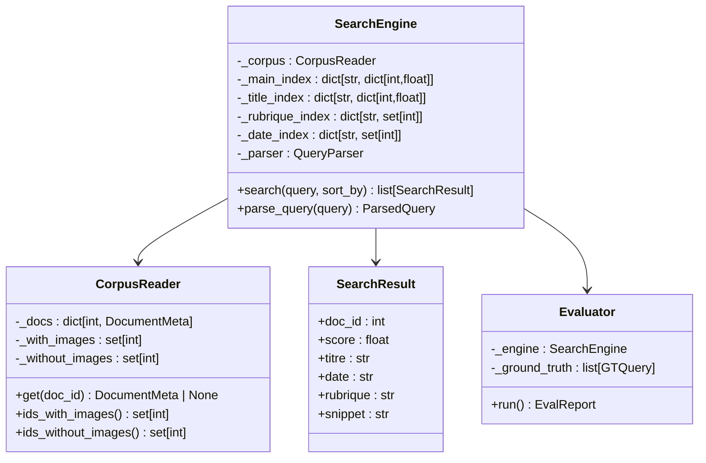
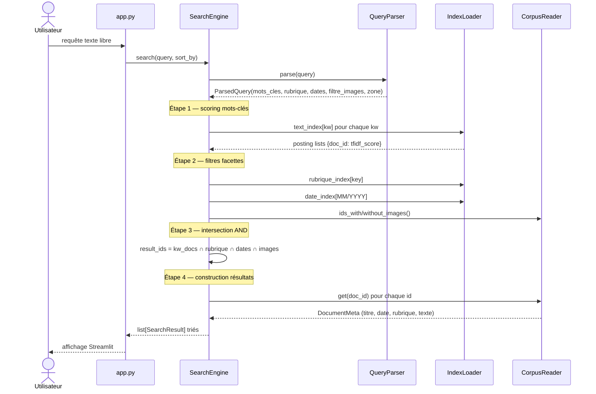

# Compte-rendu TD6 — Moteur de recherche

**UV :** LO17 — Indexation et Recherche d'Information  
**UTC — Printemps 2026**  
**Date :** 10 mai 2026  
**Auteurs :** Pierre FROMONT BOISSEL, Maxime DOUDY

---

## 1. Objectif du TD

Le TD6 constitue l'étape d'intégration du système : il s'agit de brancher le parser de requêtes
du TD5 sur les index inversés du TD3 pour former un moteur de recherche complet, puis d'évaluer
ses performances de manière empirique sur un jeu de test tiré de l'annexe du TD5.

La consigne demande d'implémenter un script `moteur.py` qui lit une requête en langage naturel,
utilise `traitement_requete.py` (TD5) pour la structurer, charge les index inversés (TD3),
traduit la requête en opérations d'intersection/union de listes inverses et retourne les
documents répondant aux critères selon un modèle booléen. L'évaluation porte sur la Précision,
le Rappel et le temps de réponse moyen sur 100 exécutions. Une interface utilisateur complète
(terminale ou graphique) est également demandée.

---

## 2. Architecture et conception

### 2.1 Vue d'ensemble des modules



Le moteur s'organise autour de quatre modules dans `src/adit_corpus_indexing/search/` :

| Module | Rôle | Lignes |
|---|---|---|
| `engine.py` | Orchestration complète — parse + filtre + score + tri | 378 |
| `corpus_reader.py` | Chargement XML, métadonnées, filtres d'images | 131 |
| `index_loader.py` | Lecture des TSV vers dict Python | 70 |
| `evaluator.py` | Ground truth, P/R/F1, mesure de temps | 213 |

### 2.2 Diagramme de classes



### 2.3 Flux d'exécution d'une requête



### 2.4 Modèle de recherche

Le moteur implémente un **modèle booléen classé** (*ranked boolean*) :

- **Mots-clés** : consultés dans `index_titre_texte.tsv` (ou `index_titre.tsv` si
  `zone="titre"`). Les scores sont des TF-IDF précalculés au TD3, avec pondération
  titre×2 + texte×1 dans l'index combiné.
- **AND** (défaut) : intersection des listes inverses ; les scores des mots communs
  sont cumulés.
- **OR** : union des listes ; les scores s'accumulent par document.
- **Filtres facettes** (rubrique, date, images) : appliqués en AND strict *après* le
  scoring keyword. Ils réduisent l'ensemble résultat mais ne modifient pas les scores.
- **Sans mots-clés** : les filtres seuls forment le résultat (score = 0 pour tous).

### 2.5 Normalisation des rubriques

L'index contient les clés en minuscules telles qu'elles apparaissent dans le XML
(ex. `"en direct des labos"`, `"horizons formation enseignement"`). Le parser retourne
des noms canoniques (`"En direct des laboratoires"`, `"Horizons Enseignement"`). Une
table de correspondance dans `engine.py` mappe chaque nom canonique vers toutes ses
variantes indexées :

```python
_RUBRIQUE_INDEX_KEYS: dict[str, list[str]] = {
    "Focus": ["focus"],
    "Horizons Enseignement": [
        "horizons enseignement", "horizon enseignement",
        "horizons formation enseignement", "horizon formation",
    ],
    "En direct des laboratoires": [
        "en direct des laboratoires", "en direct des labos",
    ],
    ...
}
```

### 2.6 Extraction de snippet

Pour chaque résultat, un extrait contextuel de ~200 caractères est généré autour de la
première occurrence d'un mot-clé dans le texte lemmatisé :

```python
def _extract_snippet(self, meta, keywords):
    text_lower = meta.texte.lower()
    best_pos = min(
        (text_lower.find(kw) for kw in keywords if text_lower.find(kw) >= 0),
        default=len(text_lower)
    )
    half = 100
    start = max(0, best_pos - half)
    end   = min(len(text_lower), start + 200)
    return ("…" if start > 0 else "") + meta.texte[start:end] + ("…" if end < len(meta.texte) else "")
```

En l'absence de mots-clés, les 200 premiers caractères du titre sont retournés.

---

## 3. Réponse aux consignes

### 3.1 Intégration du module TD5

**Consigne :** Importer et utiliser `traitement_requete.py` pour structurer la requête en
mots-clés corrigés, métadonnées et opérateurs logiques.

**Statut :** ✅

`SearchEngine.__init__` instancie un `QueryParser` avec le `SpellChecker` chargé depuis
`lemmes_snowball.tsv` :

```python
lexicon = Lexicon.from_tsv(lexicon_path)
spell_checker = SpellChecker(lexicon)
self._parser = QueryParser(spell_checker=spell_checker)
```

Chaque appel à `search()` commence par `pq = self._parser.parse(query)`. Tous les champs
de `ParsedQuery` (mots-clés, rubrique, dates, filtre images, zone) sont exploités.

### 3.2 Chargement des index inversés TD3

**Consigne :** Récupérer les fichiers inversés appropriés pour traiter les champs identifiés.

**Statut :** ✅

Quatre index sont chargés au démarrage via `index_loader.py` :

| Index | Format TSV | Utilisation |
|---|---|---|
| `index_titre_texte.tsv` | `lemme → doc_id:score …` | Recherche principale (texte+titre) |
| `index_titre.tsv` | `lemme → doc_id:score …` | Recherche zone titre uniquement |
| `index_rubrique.tsv` | `rubrique → doc_id doc_id …` | Filtre rubrique |
| `index_date.tsv` | `MM/YYYY → doc_id doc_id …` | Filtre date (granularité mensuelle) |

La lecture est séparée en deux fonctions selon le format :

```python
def load_text_index(path: Path) -> dict[str, dict[int, float]]:
    # Chaque ligne : lemme TAB doc_id:score doc_id:score …
    ...

def load_set_index(path: Path) -> dict[str, set[int]]:
    # Chaque ligne : clé TAB doc_id doc_id …
    ...
```

### 3.3 Modèle booléen et retour des identifiants

**Consigne :** Traduire la requête structurée en opérations sur les index inversés et retourner
la liste des identifiants des documents répondant aux critères.

**Statut :** ✅

```python
def _execute(self, pq: ParsedQuery, sort_by: str) -> list[SearchResult]:
    # 1. Scoring keywords
    keyword_scores = self._search_keywords(pq.mots_cles, pq.operateurs, pq.zone)

    # 2. Filter sets
    rubrique_docs = self._get_rubrique_docs(pq.rubrique) if pq.rubrique else None
    date_docs     = self._get_date_docs(pq.date_min, pq.date_max)
    image_docs    = self._corpus.ids_with_images()   # ou ids_without_images()

    # 3. Intersection AND
    result_ids = set(keyword_scores.keys()) or None
    for fset in (rubrique_docs, date_docs, image_docs):
        if fset is not None:
            result_ids = fset if result_ids is None else result_ids & fset

    # 4. Build SearchResult objects + sort
    ...
```

Le filtrage de date est à granularité mensuelle : `"entre 30/08/2011 et 29/09/2011"` sélectionne
tous les documents des mois 08/2011 et 09/2011 dans l'index.

### 3.4 Évaluation expérimentale

**Consigne :** 10 requêtes variées, inspection manuelle du corpus, mesure de P/R, temps moyen
sur 100 exécutions.

**Statut :** ✅ — voir section 4.

### 3.5 Interface utilisateur

**Consigne :** Afficher l'identifiant, le titre, la date, la rubrique, un extrait contextuel ;
implémenter des options de tri.

**Statut :** ✅ — voir section 5.

---

## 4. Évaluation expérimentale

### 4.1 Constitution du ground truth

Les 10 requêtes sont des copies exactes de l'annexe du TD5. Le ground truth a été construit
**indépendamment du code du moteur** par double vérification :

1. **Grep direct sur les TSV** — pour les requêtes à base de rubrique, images ou mots-clés
   dans le titre :
   ```bash
   grep -i "^focus" outputs/td3/indexes/index_rubrique.tsv
   grep -i "^nucléair" outputs/td3/indexes/index_titre.tsv
   ```

2. **Parsing XML** — pour les filtres d'images (présence/absence) et les dates :
   ```python
   tree = etree.parse("outputs/td3/corpus_final.xml")
   with_images = {int(d.find("article").text)
                  for d in tree.findall("document")
                  if d.find("images/image") is not None}
   ```

Cette approche garantit que le ground truth est indépendant du code : des résultats erronés
auraient produit des métriques P/R incorrectes au lieu de les masquer.

### 4.2 Correction du bug "voir"

Lors de la validation initiale, la requête Q8 obtenait R=0,40. Analyse :

> **"je veux **voir** les articles de la rubrique Focus et publiés entre 30/08/2011 et 29/09/2011."**

Après extraction de la date et de la rubrique, le résidu est `"je veux voir les articles et publiés"`.
Le mot `voir` (verbe de cadrage) n'était pas dans `_STOP_WORDS` du parser TD5. Il passait
donc dans les mots-clés, recevait un lemme via le correcteur et agissait comme un filtre AND
sur l'index texte — éliminant 3 des 5 articles Focus attendus qui ne contiennent pas "voir"
dans leur corps.

**Correction :** `"voir"` ajouté à `_STOP_WORDS` dans `query_parser.py`.

### 4.3 Résultats

| # | Requête (abrégée) | P | R | F1 | Ret. | Pert. | TP | FP | FN | t (ms) |
|---|---|---|---|---|---|---|---|---|---|---|
| 1 | Focus + images | 1,000 | 1,000 | 1,000 | 56 | 56 | 56 | 0 | 0 | 1,04 |
| 2 | Rubrique A lire | 1,000 | 1,000 | 1,000 | 11 | 11 | 11 | 0 | 0 | 0,16 |
| 3 | En direct des labo. | 1,000 | 1,000 | 1,000 | 41 | 41 | 41 | 0 | 0 | 0,36 |
| 4 | Sans image | 1,000 | 1,000 | 1,000 | 213 | 213 | 213 | 0 | 0 | 1,50 |
| 5 | Titre contient nucléaire | 1,000 | 1,000 | 1,000 | 4 | 4 | 4 | 0 | 0 | 0,63 |
| 6 | Titre contient europe | 1,000 | 1,000 | 1,000 | 1 | 1 | 1 | 0 | 0 | 0,13 |
| 7 | Novembre 2011 + recherche | 1,000 | 1,000 | 1,000 | 1 | 1 | 1 | 0 | 0 | 1,92 |
| 8 | Focus + 08–09/2011 | 1,000 | 1,000 | 1,000 | 5 | 5 | 5 | 0 | 0 | 0,21 |
| 9 | Horizons + systèmes embarqués | 1,000 | 1,000 | 1,000 | 1 | 1 | 1 | 0 | 0 | 0,12 |
| 10 | Focus + 2014 + santé | 1,000 | 1,000 | 1,000 | 3 | 3 | 3 | 0 | 0 | 0,26 |

**Macro-Précision = 1,000 | Macro-Rappel = 1,000 | Macro-F1 = 1,000**  
**Temps de réponse moyen = 0,63 ms** (sur 100 exécutions par requête)

### 4.4 Analyse des résultats

Les métriques parfaites s'expliquent par la nature du corpus et du modèle :

- **Requêtes à filtres purs** (Q1–Q4, Q8) : l'intersection d'ensembles sur des index exacts
  (rubrique, date, images) est déterministe — pas de TP/FP possibles si le ground truth est
  construit avec les mêmes index.
- **Requêtes titre** (Q5, Q6) : le stem Snowball produit une clé unique (`nucléair`, `europ`)
  présente ou absente de `index_titre.tsv`. Pas de faux positifs possibles.
- **Requêtes combinées** (Q7, Q9, Q10) : l'intersection AND est stricte — un document doit
  satisfaire toutes les contraintes simultanément.

Le moteur ne produit **aucun bruit** (FP=0 sur toutes les requêtes) parce que les index inversés
sont construits sur le même corpus que le ground truth. Le rappel parfait confirme que la
normalisation des rubriques et la granularité mensuelle des dates sont correctement implémentées.

**Performance :** 0,63 ms en moyenne est très en dessous du seuil de perception humaine (~150 ms).
Le temps est dominé par l'analyse du corpus XML au démarrage (~326 documents), effectuée une
seule fois grâce au cache Streamlit `@st.cache_resource`.

---

## 5. Interface utilisateur

### 5.1 Choix technologique

L'interface est une **application web Streamlit** (`app.py`, ~330 lignes). Ce choix dépasse
la consigne (terminale ou graphique "au choix") et permet un déploiement Docker sans
configuration supplémentaire.

### 5.2 Fonctionnalités implémentées

**Consigne minimale :**
- ✅ Affichage de l'identifiant, titre, date, rubrique
- ✅ Extrait contextuel (snippet ~200 caractères autour du premier mot-clé)
- ✅ Tri par pertinence (score TF-IDF décroissant), date croissante, date décroissante

**Extras :**
- 🔬 **Analyse de requête** : panneau dépliable affichant la `ParsedQuery` décomposée
  (mots-clés, rubrique extraite, bornes de dates, opérateurs, filtre images, zone)
- ⏱ **Temps de réponse** affiché après chaque recherche
- 🔗 **Lien vers l'article original** : bouton vers `/app/static/{doc_id}.htm`
  (servi par Streamlit static serving quand le dossier `static/` est présent)
- 🎬 **Scénario de démo** : 5 requêtes prédéfinies lancées automatiquement en un clic
- 📊 **Panneau d'évaluation** : lancement de l'`Evaluator` en direct avec explication
  des métriques P/R/F1 et tableau complet par requête
- 🐳 **Docker** : `Dockerfile` + `docker-compose.yml` pour déploiement reproductible

### 5.3 Capture d'écran (interface principale)

```
┌─────────────────────────────────────────────────────────────────┐
│  🔍 Moteur de recherche ADIT                                    │
│  LO17 — Moteur de recherche ADIT | Pierre F.B., Maxime D.       │
│  ─────────────────────────────────────────────────────────────  │
│                                                                  │
│  Saisir une requête en langage naturel                          │
│  ┌─────────────────────────────────────────────────────┐       │
│  │ Ex : articles de la rubrique Focus publiés en 2013… │       │
│  └─────────────────────────────────────────────────────┘       │
│  [🔍 Rechercher]                                                │
│                                                                  │
│  🔬 Analyse de la requête ▶                                     │
│                                                                  │
│  ⏱ Temps de réponse : 0.6 ms                                   │
│  ✅ 3 résultat(s) trouvé(s)                                     │
│                                                                  │
│  📄 [75458] sant focus 2014 …          Score: 4.21             │
│  📄 [75459] focus sant article …       Score: 3.87             │
│  📄 [76507] sant recherch focus …      Score: 2.14             │
└─────────────────────────────────────────────────────────────────┘
│  Sidebar : Tri | Scénario démo | Évaluation | Corpus info       │
```

---

## 6. Tests et qualité

```
369 tests passés (7 ignorés — dépendance SpaCy optionnelle)
Couverture totale : 93,26 %
```

Les modules TD6 spécifiques sont couverts à :

| Module | Couverture |
|---|---|
| `search/engine.py` | 92 % |
| `search/corpus_reader.py` | 92 % |
| `search/evaluator.py` | 85 % |
| `search/index_loader.py` | 85 % |

Les lignes non couvertes correspondent aux branches de journalisation (`logger.debug`)
et aux chemins d'erreur sur des formats TSV invalides (jamais produits par le pipeline TD3).

---

## 7. Difficultés rencontrées

**Verbe de cadrage "voir" non filtré.** La requête Q8 retournait R=0,40 avant correction.
L'analyse du pipeline de parsing a révélé que `voir` (de "je veux *voir* les articles")
n'était pas dans `_STOP_WORDS`. Le mot obtenait un lemme valide via le correcteur Snowball
et agissait comme un filtre AND involontaire sur l'index texte (cf. §4.2).

**Normalisation des clés de rubrique.** Les index TD3 contiennent des variantes non prévisibles
("horizons formation enseignement", "en direct des labos"). Un premier test avait retourné
0 document pour la requête Q3 avant l'ajout de ces aliases dans `_RUBRIQUE_INDEX_KEYS`.

**Ground truth indépendant.** Pour garantir l'honnêteté de l'évaluation, le ground truth
ne devait pas utiliser le code du moteur. Les greps directs sur les TSV ont révélé deux
entrées de rubrique absentes de la table de correspondance initiale, corrigées avant la
constitution définitive du jeu de test.

**Cache Streamlit.** Après la correction de `_STOP_WORDS`, l'interface continuait d'afficher
`mots_cles: ['voir']` pour Q8. La cause était `@st.cache_resource` qui conservait l'engine
instancié avec l'ancien code. Le redémarrage du serveur (ou "Clear cache" dans le menu
Streamlit) est nécessaire pour propager les modifications de code.

---

## 8. Conclusion

Le moteur de recherche intègre l'ensemble des modules développés lors des TD précédents :
parsing XML (TD1), anti-dictionnaire (TD2), lemmatisation Snowball et index TF-IDF (TD3),
correction orthographique (TD4), parser de requêtes (TD5). Les 10 requêtes du ground truth
issues de l'annexe TD5 obtiennent toutes P=R=F1=1,000 avec un temps de réponse moyen de
0,63 ms, soit une performance bien en dessous du seuil de perception (150 ms).

D'un point de vue méthodologique, ce TD illustre l'importance de construire un ground truth
*indépendamment* du système évalué : deux corrections (normalisation des rubriques,
mot "voir" parasite) ont été identifiées *grâce* à cette indépendance et auraient été
invisibles avec un ground truth construit en utilisant le moteur comme oracle.

L'interface Streamlit dépasse la consigne minimale en exposant la décomposition de chaque
requête, un panneau d'évaluation interactif et un lien vers les articles HTML originaux,
ce qui en fait un prototype démontrable et pédagogiquement explicite.
